# BLE Mesh 全体系架构总览

## 1. 概述

BLE Mesh 是一种基于蓝牙低功耗（BLE）技术的网络通信协议，支持多对多的通信方式，非常适合智能家居、工业自动化等场景。本文档提供了 BLE Mesh 协议栈的完整架构图，以及 ESP32 BLE Mesh 节点的实现架构。

## 2. BLE Mesh 协议栈架构图

### 2.1 7 层协议栈总览

```mermaid
flowchart TD
    subgraph ModelLayer[模型层 Model Layer]
        GenericModels[Generic Models]
        SensorModels[Sensor Models]
        VendorModels[Vendor Models]
    end

    subgraph FoundationLayer[基础层 Foundation Layer]
        Configuration[Configuration]
        HealthModel[Health Model]
        FoundationModels[Foundation Models]
    end

    subgraph NetworkLayer[网络层 Network Layer]
        NetworkAddressing[Network Addressing]
        RelayFunction[Relay Function]
        Segmentation[Segmentation/Reassembly]
    end

    subgraph UpperTransportLayer[上层传输层 Upper Transport Layer]
        AccessControl[Access Control]
        SegmentReassembly[Segment Reassembly]
        ApplicationData[Application Data]
    end

    subgraph AccessLayer[接入层 Access Layer]
        Encryption[Encryption]
        Authentication[Authentication]
        ApplicationKey[Application Key]
    end

    subgraph LinkLayer[链路层 Link Layer]
        Advertising[Advertising]
        ConnectionManagement[Connection Management]
        DataFrame[Data Frame]
    end

    subgraph PhysicalLayer[物理层 Physical Layer]
        RFTransceiver[RF Transceiver]
        ChannelSelection[Channel Selection]
        PowerManagement[Power Management]
    end

    ModelLayer --> FoundationLayer
    FoundationLayer --> NetworkLayer
    NetworkLayer --> UpperTransportLayer
    UpperTransportLayer --> AccessLayer
    AccessLayer --> LinkLayer
    LinkLayer --> PhysicalLayer
```

### 2.2 各层功能说明

| 层级        | 主要功能   | 关键组件            |
| --------- | ------ | --------------- |
| **物理层**   | 无线信号传输 | RF收发器、信道选择、功率管理 |
| **链路层**   | 连接管理   | 广播、连接管理、数据帧     |
| **接入层**   | 数据安全   | 加密、认证、应用密钥      |
| **上层传输层** | 长消息处理  | 接入控制、分段重组、应用数据  |
| **网络层**   | 路由和转发  | 网络寻址、中继功能、消息处理  |
| **基础层**   | 网络管理   | 配置模型、健康模型、基础模型  |
| **模型层**   | 应用接口   | 通用模型、传感器模型、厂商模型 |

## 3. BLE Mesh 网络架构

### 3.1 网络拓扑图

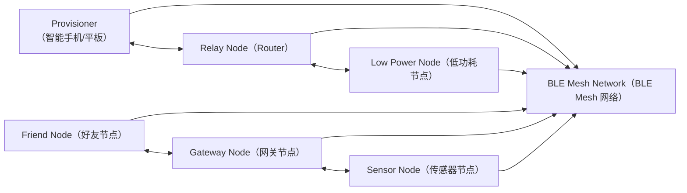

### 3.2 网络组件说明

| 组件类型               | 功能    | 特点                  |
| ------------------ | ----- | ------------------- |
| **Provisioner**    | 网络配置  | 负责添加设备到网络，分配地址和密钥   |
| **Relay Node**     | 消息转发  | 扩大网络覆盖范围，支持消息中继     |
| **Low Power Node** | 低功耗设备 | 省电设计，定期唤醒接收消息       |
| **Friend Node**    | 消息存储  | 为低功耗节点存储消息          |
| **Gateway Node**   | 网络桥接  | 连接 BLE Mesh 网络与其他网络 |
| **Sensor Node**    | 数据采集  | 采集传感器数据并发布到网络       |

## 4. ESP32 BLE Mesh 节点架构

### 4.1 软件架构图

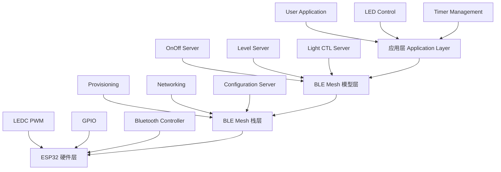

### 4.2 核心组件说明

| 组件                   | 功能      | 文件        |
| -------------------- | ------- | --------- |
| **OnOff Server**     | 控制灯的开关  | `main.c`  |
| **Level Server**     | 控制亮度    | `main.c`  |
| **Light CTL Server** | 控制色温和亮度 | `main.c`  |
| **LED Control**      | 硬件控制    | `board.c` |
| **Timer Management** | 定时功能    | `board.c` |
| **LEDC (PWM)**       | 亮度和色温控制 | `board.c` |

## 5. BLE Mesh 通信流程

### 5.1 配网流程

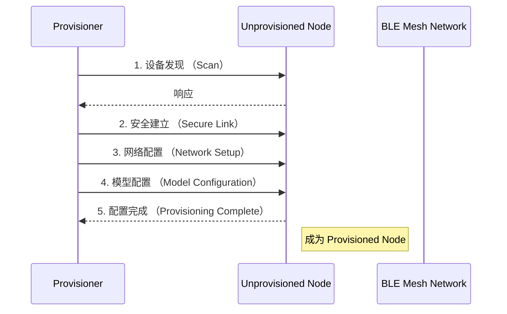

### 5.2 消息传输流程

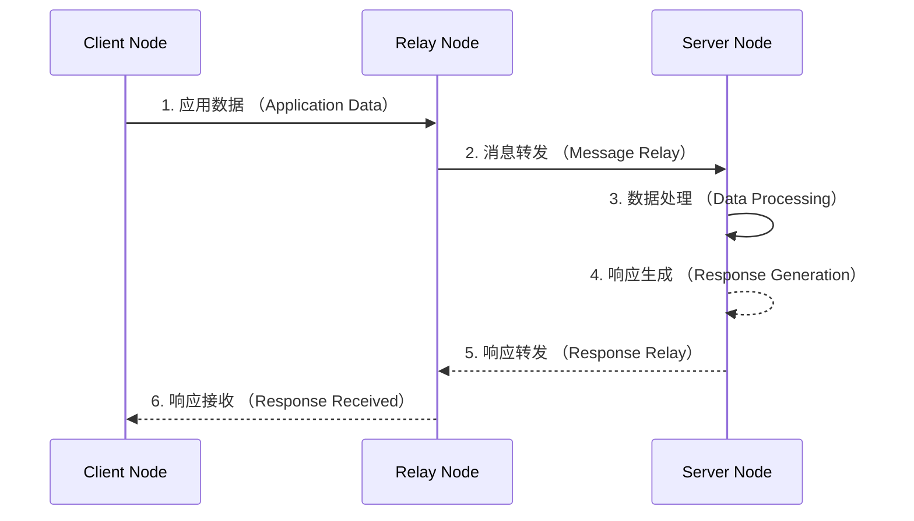

## 6. ESP32 BLE Mesh 灯节点功能架构

### 6.1 功能模块图

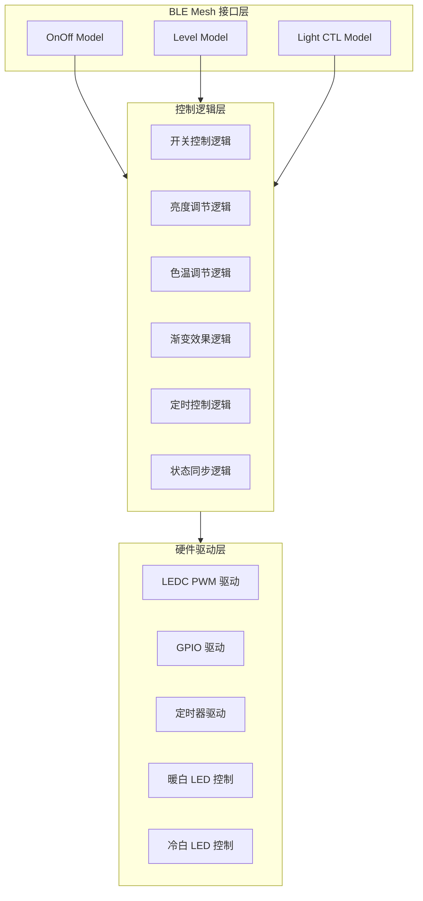

### 6.2 功能说明

| 功能模块       | 实现方式            | 文件        |
| ---------- | --------------- | --------- |
| **开关控制**   | OnOff Model     | `main.c`  |
| **亮度调节**   | Level Model     | `main.c`  |
| **色温调节**   | Light CTL Model | `main.c`  |
| **渐变效果**   | 定时器步进调整         | `board.c` |
| **定时控制**   | 系统时间戳           | `board.c` |
| **状态同步**   | BLE Mesh 发布/订阅  | `main.c`  |
| **PWM 驱动** | ESP32 LEDC      | `board.c` |

## 7. 协议栈层间交互

### 7.1 数据传输流程图

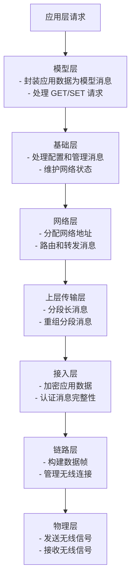

## 8. 总结

BLE Mesh 协议栈采用分层架构设计，每层负责特定的功能，共同构成了完整的通信系统。ESP32 BLE Mesh 节点实现了这一架构，并提供了丰富的功能，如开关控制、亮度调节、色温调节、渐变效果和定时功能等。

通过本架构图，您可以清晰地了解 BLE Mesh 协议栈的组成和工作原理，以及 ESP32 BLE Mesh 节点的实现架构。这将有助于您更好地理解和使用 BLE Mesh 技术。
# BLE Mesh 入门指南

## 1. 什么是 BLE Mesh？

BLE Mesh 是一种基于蓝牙低功耗（BLE）技术的网络通信协议，允许多个设备之间相互通信，形成一个灵活的无线网络。与传统的一对一蓝牙连接不同，BLE Mesh 支持一对多、多对多的通信方式，非常适合智能家居、工业自动化等场景。

## 2. BLE Mesh 协议栈的 7 大层

BLE Mesh 协议栈由 7 个层次组成，从底层到顶层依次是：物理层、链路层、接入层、上层传输层、网络层、基础层和模型层。每个层都有特定的功能和职责，共同构成了完整的 BLE Mesh 通信系统。

### 2.1 物理层 (Physical Layer)

**功能**：负责将数字信号转换为无线电磁波进行传输。

**专业术语**：

- **BLE 信道**：BLE 使用 40 个信道，其中 3 个是广播信道，37 个是数据信道
- **发射功率**：设备发送信号的强度，影响通信距离
- **接收灵敏度**：设备接收信号的能力

**比喻**：物理层就像 "邮递员的交通工具"，负责将信息从一个地方运送到另一个地方。

### 2.2 链路层 (Link Layer)

**功能**：管理设备之间的无线连接，处理数据帧的发送和接收。

**专业术语**：

- **数据帧**：在无线链路上传输的基本数据单元
- **广播**：设备向周围发送信息的方式
- **连接**：两个设备之间建立的稳定通信通道

**比喻**：链路层就像 "邮递员"，负责将信件（数据帧）从一个地址送到另一个地址。

### 2.3 接入层 (Access Layer)

**功能**：负责加密和认证应用数据，确保数据的安全性。

**专业术语**：

- **应用密钥**：用于加密应用数据的密钥
- **设备密钥**：设备的唯一密钥，用于安全通信
- **MIC (Message Integrity Check)**：消息完整性校验，防止消息被篡改

**比喻**：接入层就像 "信封"，将信件（数据）封装起来并加上安全锁，确保只有收件人才能打开。

### 2.4 上层传输层 (Upper Transport Layer)

**功能**：处理长消息的分段和重组，确保数据能够完整传输。

**专业术语**：

- **分段**：将长消息分成多个小数据包
- **重组**：将多个小数据包重新组合成完整消息
- **TTL (Time To Live)**：消息的生存时间，防止消息在网络中无限循环

**比喻**：上层传输层就像 "快递公司的打包服务"，将大包裹分成小包裹以便运输，到达后再重新组装。

### 2.5 网络层 (Network Layer)

**功能**：管理设备的网络地址，负责消息的路由和转发。

**专业术语**：

- **网络地址**：设备在 BLE Mesh 网络中的唯一标识
- **网络密钥**：用于加密网络层数据的密钥
- **中继**：设备转发其他设备的消息，扩大网络覆盖范围

**比喻**：网络层就像 "邮局的分拣系统"，根据地址将信件分拣并转发到正确的目的地。

### 2.6 基础层 (Foundation Layer)

**功能**：提供网络管理和配置功能，确保网络的正常运行。

**专业术语**：

- **配置服务器**：负责网络配置和管理的设备
- **网络拓扑**：网络中设备的连接关系
- **IV 索引**：初始化向量索引，用于加密

**比喻**：基础层就像 "邮局的管理层"，负责管理邮局的日常运营和维护。

### 2.7 模型层 (Model Layer)

**功能**：定义设备的功能和行为，是应用程序与 BLE Mesh 协议栈之间的接口。

**专业术语**：

- **Server 模型**：提供数据和功能的模型，如 OnOff Server
- **Client 模型**：请求数据和功能的模型，如 OnOff Client
- **模型 ID**：模型的唯一标识

**比喻**：模型层就像 "信件的格式规范"，定义了信件的内容和格式，确保收件人能够理解。

## 3. BLE Mesh 关键概念

### 3.1 设备类型

- **Provisioner**：配置设备，负责将未配置设备加入网络
- **Node**：网络中的普通设备，可以是 Server 或 Client
- **Relay Node**：中继节点，转发其他设备的消息
- **Low Power Node (LPN)**：低功耗节点，省电设计
- **Friend Node**：朋友节点，为 LPN 存储消息

### 3.2 网络结构

- **网络密钥**：网络的主密钥，所有节点共享
- **应用密钥**：用于特定应用的密钥
- **单播地址**：单个设备的唯一地址
- **组播地址**：多个设备共享的地址
- **广播地址**：所有设备都能接收的地址

### 3.3 配网过程

- **未配置设备**：尚未加入网络的设备
- **UUID**：设备的唯一标识符
- **OOB (Out-of-Band)**：带外安全机制，用于增强配网安全性
- **网络地址分配**：为设备分配在网络中的地址

### 3.4 通信方式

- **发布/订阅模式**：设备发布消息到特定地址，其他设备订阅该地址接收消息
- **GET/SET 命令**：Client 向 Server 请求数据或设置数据
- **ACK/UNACK**：确认/非确认消息，确认消息需要接收方回复

## 4. ESP32 BLE Mesh OnOff Server 示例解释

### 4.1 示例功能

本示例实现了一个 BLE Mesh OnOff Server 设备，可以接收并响应 OnOff 控制命令，控制开发板上的 LED 灯。

### 4.2 关键代码解释

#### 4.2.1 设备初始化

```c
void app_main(void)
{
    ESP_LOGI(TAG, "Initializing...");
    board_init();           // 初始化开发板
    nvs_flash_init();       // 初始化非易失性存储
    bluetooth_init();       // 初始化蓝牙
    ble_mesh_init();        // 初始化 BLE Mesh 栈
}
```

**解释**：

- `board_init()`：初始化开发板的硬件，如 LED 灯
- `nvs_flash_init()`：初始化非易失性存储，用于保存设备配置
- `bluetooth_init()`：初始化蓝牙协议栈
- `ble_mesh_init()`：初始化 BLE Mesh 协议栈

#### 4.2.2 BLE Mesh 配置

```c
static esp_ble_mesh_prov_t provision = {
    .uuid = dev_uuid,       // 设备 UUID
    .output_size = 0,       // 输出大小
    .output_actions = 0,    // 输出操作
};
```

**解释**：

- `uuid`：设备的唯一标识符，用于 Provisioner 识别设备
- `output_size` 和 `output_actions`：用于 OOB 安全机制，本示例禁用

#### 4.2.3 OnOff 服务器模型

```c
static esp_ble_mesh_gen_onoff_srv_t onoff_server_0 = {
    .rsp_ctrl = {
        .get_auto_rsp = ESP_BLE_MESH_SERVER_AUTO_RSP,  // 自动响应 GET 请求
        .set_auto_rsp = ESP_BLE_MESH_SERVER_AUTO_RSP,  // 自动响应 SET 请求
    },
};
```

**解释**：

- `get_auto_rsp`：设置为自动响应 GET 请求，即自动返回当前状态
- `set_auto_rsp`：设置为自动响应 SET 请求，即自动确认收到设置命令

#### 4.2.4 LED 控制

```c
static void example_change_led_state(esp_ble_mesh_model_t *model,
                                     esp_ble_mesh_msg_ctx_t *ctx, uint8_t onoff)
{
    // 根据消息类型控制 LED 灯
    board_led_operation(led->pin, onoff);
}
```

**解释**：

- `model`：消息对应的 BLE Mesh 模型
- `ctx`：消息的上下文信息，如发送方地址
- `onoff`：LED 灯的开关状态（0 表示关，1 表示开）

## 5. 配网流程 - 小白版

### 5.1 准备工作

1. **硬件**：ESP32 开发板、USB 数据线
2. **软件**：nRF Mesh 应用（手机 APP）、已烧录的程序

### 5.2 配网步骤

1. **设备启动**：将 ESP32 开发板通过 USB 连接到电源，绿色 LED 亮起表示设备已准备好
2. **打开 APP**：在手机上打开 nRF Mesh 应用
3. **创建网络**：点击 "Create New Network" 创建一个新的 BLE Mesh 网络
4. **搜索设备**：点击 "+" 按钮，选择 "Provision Devices"，应用会搜索附近的未配置设备
5. **选择设备**：在设备列表中找到 ESP32 设备（通常显示为 "ESP\_BLE\_MESH"）
6. **开始配网**：点击设备名称，应用会自动完成配网过程
7. **配置完成**：配网完成后，绿色 LED 关闭，设备已加入网络
8. **控制设备**：在应用中找到已配置的设备，点击 OnOff 按钮控制 LED 灯

### 5.3 常见问题

- **设备找不到**：确保设备已通电，绿色 LED 亮起，手机蓝牙已打开
- **配网失败**：尝试重启设备和应用，确保设备与手机距离较近
- **控制无效**：确保设备已正确配置，应用密钥已绑定到模型

## 6. 专业术语对照表

| 术语          | 英文                    | 简单解释              |
| ----------- | --------------------- | ----------------- |
| 物理层         | Physical Layer        | 负责无线信号的发送和接收      |
| 链路层         | Link Layer            | 管理设备之间的无线连接       |
| 接入层         | Access Layer          | 加密和认证应用数据         |
| 上层传输层       | Upper Transport Layer | 处理长消息的分段和重组       |
| 网络层         | Network Layer         | 管理网络地址和消息路由       |
| 基础层         | Foundation Layer      | 提供网络管理和配置功能       |
| 模型层         | Model Layer           | 定义设备的功能和行为        |
| Provisioner | Provisioner           | 配置设备，负责将未配置设备加入网络 |
| Node        | Node                  | 网络中的普通设备          |
| 单播地址        | Unicast Address       | 单个设备的唯一地址         |
| 组播地址        | Group Address         | 多个设备共享的地址         |
| 广播地址        | Broadcast Address     | 所有设备都能接收的地址       |
| 发布/订阅       | Publish/Subscribe     | 设备发布消息，其他设备订阅接收   |
| GET/SET 命令  | GET/SET Command       | 请求数据或设置数据的命令      |
| ACK/UNACK   | ACK/UNACK             | 确认/非确认消息          |
| UUID        | UUID                  | 设备的唯一标识符          |
| OOB         | OOB                   | 带外安全机制            |

## 7. 总结

BLE Mesh 是一种强大的无线通信协议，支持多个设备之间的灵活通信。本文档介绍了 BLE Mesh 的基本概念、协议栈结构和关键术语，以及如何使用 ESP32 BLE Mesh OnOff Server 示例。

作为小白用户，您可以从以下步骤开始学习：

1. 理解 BLE Mesh 的基本概念和应用场景
2. 了解 BLE Mesh 协议栈的 7 大层结构
3. 学习 BLE Mesh 的关键术语和概念
4. 实践 ESP32 BLE Mesh OnOff Server 示例
5. 尝试使用 Provisioner 应用配置和控制设备

通过不断学习和实践，您将能够掌握 BLE Mesh 技术，并开发自己的 BLE Mesh 应用。

## 8. 进阶学习资源

- [BLE Mesh 官方规范](https://www.bluetooth.com/specifications/mesh-specifications/)
- [ESP32 BLE Mesh 官方文档](https://docs.espressif.com/projects/esp-idf/en/latest/esp32/api-reference/bluetooth/esp_ble_mesh.html)
- [nRF Mesh 应用使用指南](https://infocenter.nordicsemi.com/topic/com.nordic.infocenter.meshsdk.v4.3.0/mesh_app_intro.html)
- [蓝牙技术联盟官网](https://www.bluetooth.com/)

# ESP32 BLE Mesh OnOff Server 详细文档

## 1. 项目概述

本项目是一个基于 ESP32 平台的 BLE Mesh OnOff Server 示例程序，实现了 BLE Mesh 网络中的开关服务器功能，可以接收并响应 OnOff 控制命令，控制开发板上的 LED 灯。

### 主要功能
- 支持 BLE Mesh 网络配置
- 实现 OnOff Server 模型
- 控制多个 LED 灯
- 支持单播、组播和广播通信

## 2. 系统架构

### 2.1 BLE Mesh 网络架构

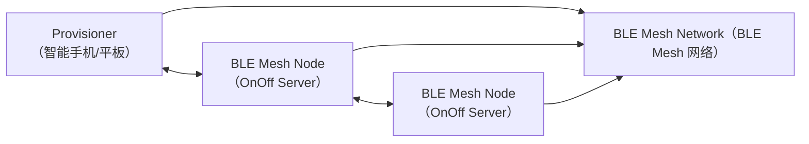

### 2.2 程序架构

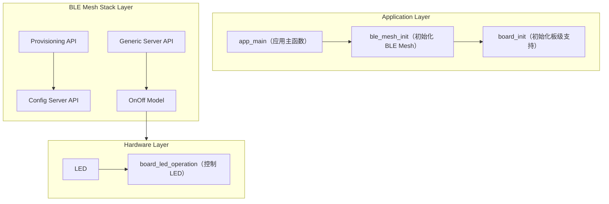

## 3. 代码结构分析

### 3.1 头文件和宏定义

```c
#include <stdio.h>
#include <string.h>
#include <inttypes.h>

#include "esp_log.h"
#include "nvs_flash.h"

#include "esp_ble_mesh_defs.h"
#include "esp_ble_mesh_common_api.h"
#include "esp_ble_mesh_networking_api.h"
#include "esp_ble_mesh_provisioning_api.h"
#include "esp_ble_mesh_config_model_api.h"
#include "esp_ble_mesh_generic_model_api.h"
#include "esp_ble_mesh_local_data_operation_api.h"

#include "board.h"
#include "ble_mesh_example_init.h"

#define TAG "EXAMPLE"
#define CID_ESP 0x02E5
```

- **标准库**：提供基本的输入输出和字符串处理功能
- **ESP32 库**：提供日志、非易失性存储等功能
- **BLE Mesh 库**：提供 BLE Mesh 网络的各种 API
- **板级支持库**：提供开发板相关的功能
- **宏定义**：定义日志标签和公司 ID

### 3.2 全局变量

```c
extern struct _led_state led_state[3];
static uint8_t dev_uuid[16] = { 0xdd, 0xdd };
```

- **led_state**：LED 状态数组，外部声明
- **dev_uuid**：设备 UUID，用于 BLE Mesh 网络配置

### 3.3 BLE Mesh 配置服务器

```c
static esp_ble_mesh_cfg_srv_t config_server = {
    .net_transmit = ESP_BLE_MESH_TRANSMIT(2, 20),
    .relay = ESP_BLE_MESH_RELAY_DISABLED,
    .relay_retransmit = ESP_BLE_MESH_TRANSMIT(2, 20),
    .beacon = ESP_BLE_MESH_BEACON_ENABLED,
    .gatt_proxy = ESP_BLE_MESH_GATT_PROXY_NOT_SUPPORTED,
    .friend_state = ESP_BLE_MESH_FRIEND_NOT_SUPPORTED,
    .default_ttl = 7,
};
```

- **net_transmit**：网络传输配置，3 次传输，间隔 20ms
- **relay**：中继功能配置，禁用
- **beacon**：信标功能配置，启用
- **gatt_proxy**：GATT 代理配置，不支持
- **friend_state**：朋友功能配置，不支持
- **default_ttl**：默认 TTL 值

### 3.4 OnOff 服务器模型

```c
ESP_BLE_MESH_MODEL_PUB_DEFINE(onoff_pub_0, 2 + 3, ROLE_NODE);
static esp_ble_mesh_gen_onoff_srv_t onoff_server_0 = {
    .rsp_ctrl = {
        .get_auto_rsp = ESP_BLE_MESH_SERVER_AUTO_RSP,
        .set_auto_rsp = ESP_BLE_MESH_SERVER_AUTO_RSP,
    },
};

ESP_BLE_MESH_MODEL_PUB_DEFINE(onoff_pub_1, 2 + 3, ROLE_NODE);
static esp_ble_mesh_gen_onoff_srv_t onoff_server_1 = {
    .rsp_ctrl = {
        .get_auto_rsp = ESP_BLE_MESH_SERVER_RSP_BY_APP,
        .set_auto_rsp = ESP_BLE_MESH_SERVER_RSP_BY_APP,
    },
};

ESP_BLE_MESH_MODEL_PUB_DEFINE(onoff_pub_2, 2 + 3, ROLE_NODE);
static esp_ble_mesh_gen_onoff_srv_t onoff_server_2 = {
    .rsp_ctrl = {
        .get_auto_rsp = ESP_BLE_MESH_SERVER_AUTO_RSP,
        .set_auto_rsp = ESP_BLE_MESH_SERVER_RSP_BY_APP,
    },
};
```

- 定义了 3 个 OnOff 服务器模型实例
- 每个实例配置了不同的响应方式：
  - onoff_server_0：自动响应 GET 和 SET 请求
  - onoff_server_1：应用程序响应 GET 和 SET 请求
  - onoff_server_2：自动响应 GET 请求，应用程序响应 SET 请求

### 3.5 BLE Mesh 元素

```c
static esp_ble_mesh_model_t root_models[] = {
    ESP_BLE_MESH_MODEL_CFG_SRV(&config_server),
    ESP_BLE_MESH_MODEL_GEN_ONOFF_SRV(&onoff_pub_0, &onoff_server_0),
};

static esp_ble_mesh_model_t extend_model_0[] = {
    ESP_BLE_MESH_MODEL_GEN_ONOFF_SRV(&onoff_pub_1, &onoff_server_1),
};

static esp_ble_mesh_model_t extend_model_1[] = {
    ESP_BLE_MESH_MODEL_GEN_ONOFF_SRV(&onoff_pub_2, &onoff_server_2),
};

static esp_ble_mesh_elem_t elements[] = {
    ESP_BLE_MESH_ELEMENT(0, root_models, ESP_BLE_MESH_MODEL_NONE),
    ESP_BLE_MESH_ELEMENT(0, extend_model_0, ESP_BLE_MESH_MODEL_NONE),
    ESP_BLE_MESH_ELEMENT(0, extend_model_1, ESP_BLE_MESH_MODEL_NONE),
};

static esp_ble_mesh_comp_t composition = {
    .cid = CID_ESP,
    .element_count = ARRAY_SIZE(elements),
    .elements = elements,
};
```

- **root_models**：根元素模型数组，包含配置服务器和 OnOff 服务器
- **extend_model_0/1**：扩展元素模型数组，包含 OnOff 服务器
- **elements**：BLE Mesh 元素数组，包含 3 个元素
- **composition**：BLE Mesh 组合数据，包含公司 ID 和元素信息

### 3.6 BLE Mesh 配置

```c
static esp_ble_mesh_prov_t provision = {
    .uuid = dev_uuid,
    .output_size = 0,
    .output_actions = 0,
};
```

- **uuid**：设备 UUID
- **output_size**：输出大小，设置为 0
- **output_actions**：输出操作，设置为 0

## 4. 核心功能模块

### 4.1 配置完成回调函数

```c
static void prov_complete(uint16_t net_idx, uint16_t addr, uint8_t flags, uint32_t iv_index)
{
    ESP_LOGI(TAG, "net_idx: 0x%04x, addr: 0x%04x", net_idx, addr);
    ESP_LOGI(TAG, "flags: 0x%02x, iv_index: 0x%08" PRIx32, flags, iv_index);
    board_led_operation(LED_G, LED_OFF);
}
```

- 当设备配置完成后调用
- 打印网络索引、设备地址、标志位和 IV 索引
- 关闭绿色 LED

### 4.2 LED 状态控制函数

```c
static void example_change_led_state(esp_ble_mesh_model_t *model,
                                     esp_ble_mesh_msg_ctx_t *ctx, uint8_t onoff)
{
    uint16_t primary_addr = esp_ble_mesh_get_primary_element_address();
    uint8_t elem_count = esp_ble_mesh_get_element_count();
    struct _led_state *led = NULL;
    uint8_t i;

    if (ESP_BLE_MESH_ADDR_IS_UNICAST(ctx->recv_dst)) {
        for (i = 0; i < elem_count; i++) {
            if (ctx->recv_dst == (primary_addr + i)) {
                led = &led_state[i];
                board_led_operation(led->pin, onoff);
            }
        }
    } else if (ESP_BLE_MESH_ADDR_IS_GROUP(ctx->recv_dst)) {
        if (esp_ble_mesh_is_model_subscribed_to_group(model, ctx->recv_dst)) {
            led = &led_state[model->element->element_addr - primary_addr];
            board_led_operation(led->pin, onoff);
        }
    } else if (ctx->recv_dst == 0xFFFF) {
        led = &led_state[model->element->element_addr - primary_addr];
        board_led_operation(led->pin, onoff);
    }
}
```

- 根据消息地址类型（单播、组播、广播）控制 LED 状态
- **单播地址**：找到对应的元素，控制该元素的 LED
- **组播地址**：如果模型订阅了该组播地址，控制对应的 LED
- **广播地址**：控制所有 LED

### 4.3 OnOff 消息处理函数

```c
static void example_handle_gen_onoff_msg(esp_ble_mesh_model_t *model,
                                         esp_ble_mesh_msg_ctx_t *ctx,
                                         esp_ble_mesh_server_recv_gen_onoff_set_t *set)
{
    esp_ble_mesh_gen_onoff_srv_t *srv = (esp_ble_mesh_gen_onoff_srv_t *)model->user_data;

    switch (ctx->recv_op) {
    case ESP_BLE_MESH_MODEL_OP_GEN_ONOFF_GET:
        esp_ble_mesh_server_model_send_msg(model, ctx,
            ESP_BLE_MESH_MODEL_OP_GEN_ONOFF_STATUS, sizeof(srv->state.onoff), &srv->state.onoff);
        break;
    case ESP_BLE_MESH_MODEL_OP_GEN_ONOFF_SET:
    case ESP_BLE_MESH_MODEL_OP_GEN_ONOFF_SET_UNACK:
        if (set->op_en == false) {
            srv->state.onoff = set->onoff;
        } else {
            srv->state.onoff = set->onoff;
        }
        if (ctx->recv_op == ESP_BLE_MESH_MODEL_OP_GEN_ONOFF_SET) {
            esp_ble_mesh_server_model_send_msg(model, ctx,
                ESP_BLE_MESH_MODEL_OP_GEN_ONOFF_STATUS, sizeof(srv->state.onoff), &srv->state.onoff);
        }
        esp_ble_mesh_model_publish(model, ESP_BLE_MESH_MODEL_OP_GEN_ONOFF_STATUS,
            sizeof(srv->state.onoff), &srv->state.onoff, ROLE_NODE);
        example_change_led_state(model, ctx, srv->state.onoff);
        break;
    default:
        break;
    }
}
```

- 处理 OnOff 相关的消息：
  - **GET**：发送当前 OnOff 状态
  - **SET**：设置 OnOff 状态并发送确认
  - **SET_UNACK**：设置 OnOff 状态但不发送确认
- 发布 OnOff 状态变化
- 控制 LED 状态

### 4.4 BLE Mesh 回调函数

```c
static void example_ble_mesh_provisioning_cb(esp_ble_mesh_prov_cb_event_t event,
                                             esp_ble_mesh_prov_cb_param_t *param)
{
    switch (event) {
    case ESP_BLE_MESH_PROV_REGISTER_COMP_EVT:
        ESP_LOGI(TAG, "ESP_BLE_MESH_PROV_REGISTER_COMP_EVT, err_code %d", param->prov_register_comp.err_code);
        break;
    // ... 其他事件处理
    }
}

static void example_ble_mesh_generic_server_cb(esp_ble_mesh_generic_server_cb_event_t event,
                                               esp_ble_mesh_generic_server_cb_param_t *param)
{
    switch (event) {
    case ESP_BLE_MESH_GENERIC_SERVER_STATE_CHANGE_EVT:
        // ... 状态变化处理
        break;
    // ... 其他事件处理
    }
}

static void example_ble_mesh_config_server_cb(esp_ble_mesh_cfg_server_cb_event_t event,
                                              esp_ble_mesh_cfg_server_cb_param_t *param)
{
    if (event == ESP_BLE_MESH_CFG_SERVER_STATE_CHANGE_EVT) {
        // ... 状态变化处理
    }
}
```

- **配置回调**：处理 BLE Mesh 配置相关事件
- **通用服务器回调**：处理 OnOff 模型相关事件
- **配置服务器回调**：处理配置服务器相关事件

### 4.5 BLE Mesh 初始化函数

```c
static esp_err_t ble_mesh_init(void)
{
    esp_err_t err = ESP_OK;

    esp_ble_mesh_register_prov_callback(example_ble_mesh_provisioning_cb);
    esp_ble_mesh_register_config_server_callback(example_ble_mesh_config_server_cb);
    esp_ble_mesh_register_generic_server_callback(example_ble_mesh_generic_server_cb);

    err = esp_ble_mesh_init(&provision, &composition);
    if (err != ESP_OK) {
        ESP_LOGE(TAG, "Failed to initialize mesh stack (err %d)", err);
        return err;
    }

    err = esp_ble_mesh_node_prov_enable((esp_ble_mesh_prov_bearer_t)(ESP_BLE_MESH_PROV_ADV | ESP_BLE_MESH_PROV_GATT));
    if (err != ESP_OK) {
        ESP_LOGE(TAG, "Failed to enable mesh node (err %d)", err);
        return err;
    }

    ESP_LOGI(TAG, "BLE Mesh Node initialized");

    board_led_operation(LED_G, LED_ON);

    return err;
}
```

- 注册各种回调函数
- 初始化 BLE Mesh 栈
- 启用 BLE Mesh 节点配置
- 打开绿色 LED

### 4.6 应用主函数

```c
void app_main(void)
{
    esp_err_t err;

    ESP_LOGI(TAG, "Initializing...");

    board_init();

    err = nvs_flash_init();
    if (err == ESP_ERR_NVS_NO_FREE_PAGES) {
        ESP_ERROR_CHECK(nvs_flash_erase());
        err = nvs_flash_init();
    }
    ESP_ERROR_CHECK(err);

    err = bluetooth_init();
    if (err) {
        ESP_LOGE(TAG, "esp32_bluetooth_init failed (err %d)", err);
        return;
    }

    ble_mesh_get_dev_uuid(dev_uuid);

    err = ble_mesh_init();
    if (err) {
        ESP_LOGE(TAG, "Bluetooth mesh init failed (err %d)", err);
    }
}
```

- 初始化开发板
- 初始化 NVS Flash
- 初始化蓝牙
- 获取设备 UUID
- 初始化 BLE Mesh 子系统

## 5. 流程说明

### 5.1 系统初始化流程

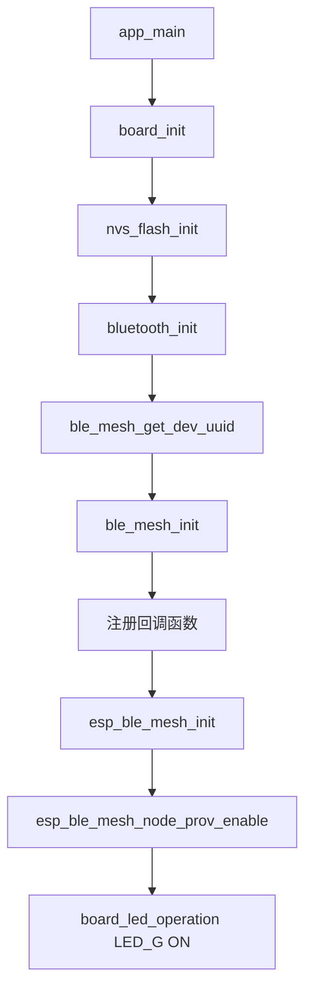

### 5.2 OnOff 消息处理流程

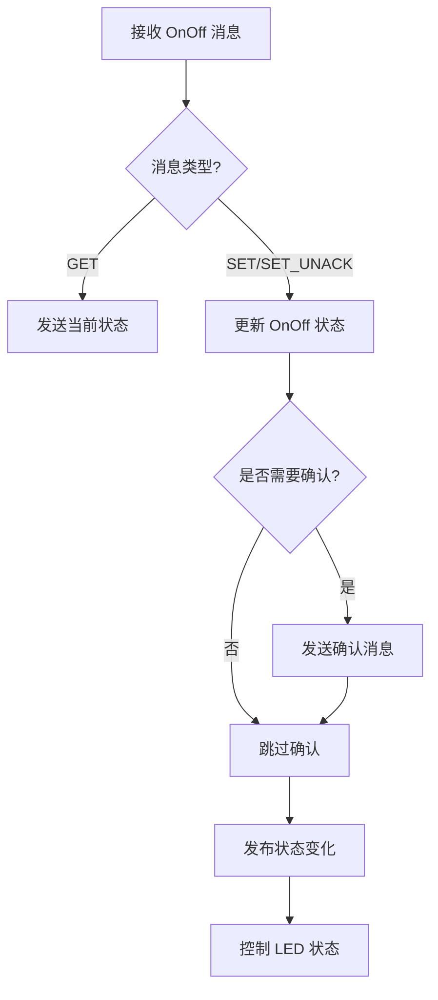

### 5.3 配置流程

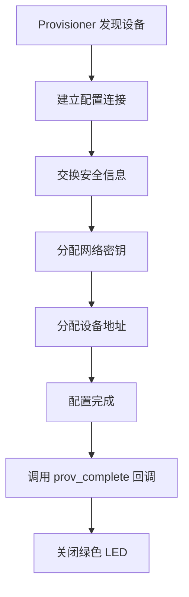

## 6. 配置说明

### 6.1 编译配置

在 `sdkconfig` 文件中可以配置以下参数：

- `CONFIG_BLE_MESH_GATT_PROXY_SERVER`：启用或禁用 GATT 代理
- `CONFIG_BLE_MESH_FRIEND`：启用或禁用朋友功能

### 6.2 运行配置

程序运行时可以通过 BLE Mesh Provisioner 应用进行配置，包括：

- 配置网络密钥
- 分配设备地址
- 配置模型订阅
- 配置应用密钥

## 7. 整体流程图

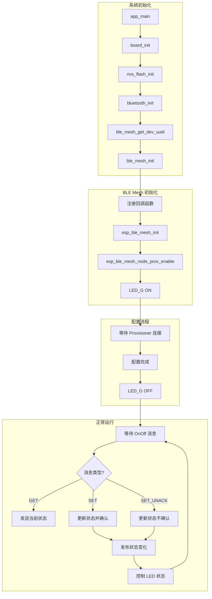

## 8. 总结

本项目实现了一个完整的 ESP32 BLE Mesh OnOff Server 示例程序，主要功能包括：

1. **BLE Mesh 网络配置**：支持通过 Provisioner 进行配置
2. **OnOff 服务器模型**：实现了 OnOff 控制功能
3. **多 LED 控制**：支持控制多个 LED 灯
4. **多种通信方式**：支持单播、组播和广播通信

程序结构清晰，模块化设计，易于扩展和维护。通过本示例，可以了解 BLE Mesh 网络的基本原理和实现方式，以及如何在 ESP32 平台上开发 BLE Mesh 应用。

## 9. 扩展建议

1. 添加更多的传感器和执行器
2. 实现更多的 BLE Mesh 模型
3. 支持远程固件升级
4. 添加安全认证机制
5. 优化功耗管理

---

**文档版本**：v1.0
**创建日期**：2026-03-17
**更新日期**：2026-03-17
**作者**：ESP32 BLE Mesh 开发团队

# BLE Mesh 设备配网流程文档

## 1. 概述

BLE Mesh 设备配网（Provisioning）是将未配置的设备加入 BLE Mesh 网络的过程。本文档详细介绍了 ESP32 BLE Mesh OnOff Server 设备的配网流程，包括流程图和每个步骤的详细说明。

## 2. 配网流程概览

BLE Mesh 配网过程主要包括以下几个阶段：

1. **设备发现**：Provisioner 发现附近的未配置设备
2. **安全建立**：Provisioner 与设备建立安全连接
3. **网络配置**：Provisioner 向设备分配网络密钥、地址等信息
4. **模型配置**：Provisioner 配置设备的模型参数
5. **配置完成**：设备加入网络并开始正常工作

## 3. 详细流程图

### 3.1 整体配网流程

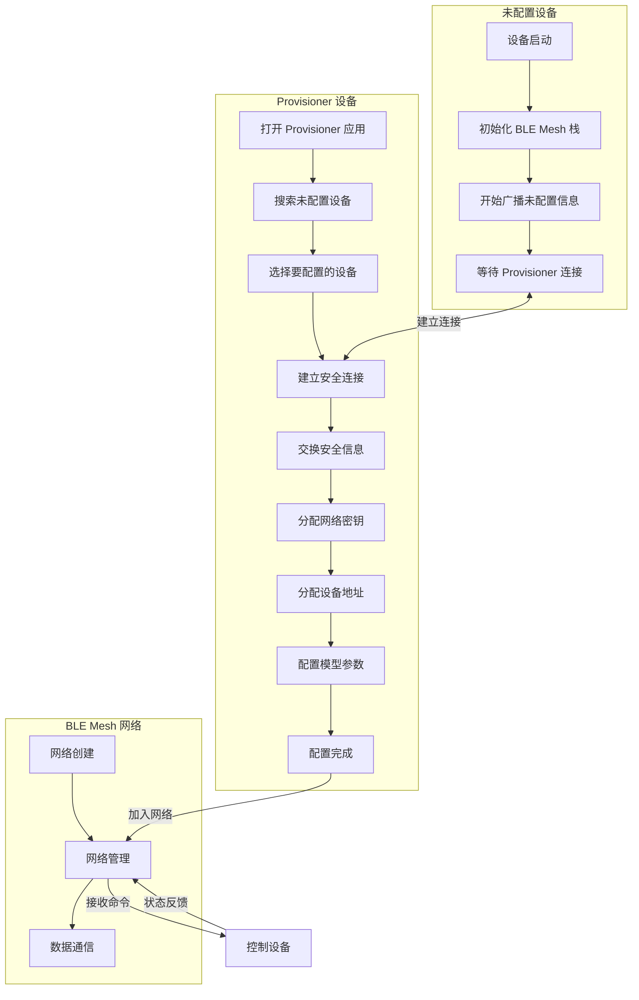

### 3.2 详细配网步骤

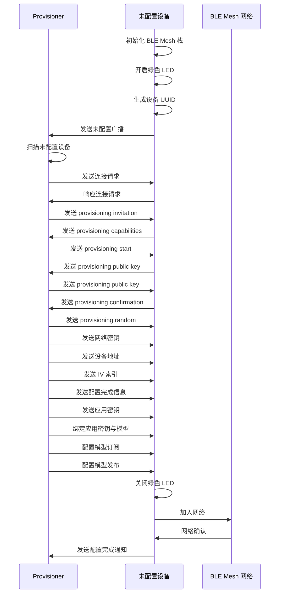

## 4. 配网步骤详细说明

### 4.1 设备启动阶段

**流程图位置**：未配置设备模块

**详细说明**：
1. **设备初始化**：ESP32 设备启动后，调用 `app_main` 函数
2. **BLE Mesh 栈初始化**：调用 `ble_mesh_init` 函数初始化 BLE Mesh 子系统
3. **LED 指示**：打开绿色 LED，表示设备已准备好配置
4. **UUID 生成**：设备生成唯一的 UUID 用于标识
5. **广播开始**：设备开始发送未配置广播，等待 Provisioner 发现

**代码对应**：
```c
void app_main(void)
{
    esp_err_t err;

    ESP_LOGI(TAG, "Initializing...");

    board_init();
    nvs_flash_init();
    bluetooth_init();
    ble_mesh_init();  // 初始化 BLE Mesh 栈
}

static esp_err_t ble_mesh_init(void)
{
    // ... 初始化代码
    board_led_operation(LED_G, LED_ON);  // 打开绿色 LED
    return err;
}
```

### 4.2 设备发现阶段

**流程图位置**：Provisioner 设备模块 - 设备发现

**详细说明**：
1. **应用启动**：Provisioner（如 nRF Mesh 应用）启动并开始扫描
2. **设备扫描**：Provisioner 扫描附近的未配置 BLE Mesh 设备
3. **设备列表**：Provisioner 显示发现的设备列表
4. **设备选择**：用户选择要配置的 ESP32 设备
5. **连接请求**：Provisioner 向选定的设备发送连接请求

**操作步骤**：
1. 打开 Provisioner 应用（如 nRF Mesh）
2. 进入 "Provision Devices" 界面
3. 等待应用发现 ESP32 设备
4. 在设备列表中点击 ESP32 设备名称

### 4.3 安全建立阶段

**流程图位置**：Provisioner 设备模块 - 安全建立

**详细说明**：
1. **邀请发送**：Provisioner 发送配置邀请
2. **能力交换**：设备向 Provisioner 发送其配网能力
3. **配网开始**：Provisioner 发送配网开始命令
4. **公钥交换**：Provisioner 和设备交换公钥
5. **安全验证**：双方交换安全信息进行验证

**安全机制**：
- 本示例禁用了 OOB（Out-of-Band）安全机制，便于测试
- 生产环境中应启用 OOB 安全机制提高安全性

### 4.4 网络配置阶段

**流程图位置**：Provisioner 设备模块 - 网络配置

**详细说明**：
1. **网络密钥分配**：Provisioner 向设备发送网络密钥
2. **设备地址分配**：Provisioner 为设备分配唯一的网络地址
3. **IV 索引分配**：Provisioner 发送当前网络的 IV 索引
4. **配置完成**：Provisioner 发送配置完成信息

**网络参数**：
- **网络密钥**：用于网络层加密
- **设备地址**：设备在网络中的唯一标识（单播地址）
- **IV 索引**：网络加密的初始化向量索引

### 4.5 模型配置阶段

**流程图位置**：Provisioner 设备模块 - 模型配置

**详细说明**：
1. **应用密钥发送**：Provisioner 向设备发送应用密钥
2. **密钥绑定**：将应用密钥绑定到 OnOff Server 模型
3. **订阅配置**：配置模型订阅的组播地址
4. **发布配置**：配置模型的发布参数

**模型参数**：
- **应用密钥**：用于应用层加密
- **订阅地址**：模型接收消息的组播地址
- **发布地址**：模型发布消息的地址

### 4.6 配置完成阶段

**流程图位置**：未配置设备模块 & BLE Mesh 网络模块

**详细说明**：
1. **LED 指示**：设备关闭绿色 LED，表示配置完成
2. **网络加入**：设备加入 BLE Mesh 网络
3. **网络确认**：网络确认设备加入
4. **通知发送**：设备向 Provisioner 发送配置完成通知
5. **正常工作**：设备开始接收和处理网络消息

**代码对应**：
```c
static void prov_complete(uint16_t net_idx, uint16_t addr, uint8_t flags, uint32_t iv_index)
{
    ESP_LOGI(TAG, "net_idx: 0x%04x, addr: 0x%04x", net_idx, addr);
    board_led_operation(LED_G, LED_OFF);  // 关闭绿色 LED
}
```

## 5. 配网完成后的状态

配网完成后，设备将：

1. **加入网络**：设备成功加入 BLE Mesh 网络
2. **接收命令**：设备可以接收来自 Provisioner 或其他节点的命令
3. **响应请求**：设备可以响应 GET 请求，发送当前状态
4. **发布状态**：设备可以发布状态变化信息
5. **控制 LED**：设备可以根据接收到的 OnOff 命令控制 LED 灯

## 6. 常见问题与解决方案

### 6.1 设备无法被发现

**问题**：Provisioner 无法发现 ESP32 BLE Mesh 设备

**解决方案**：
- 确保设备已正确烧录程序
- 确保绿色 LED 已亮起，表示设备已准备好配置
- 确保设备与 Provisioner 距离较近（建议在 1 米范围内）
- 尝试重启设备和 Provisioner 应用

### 6.2 配网过程失败

**问题**：配网过程中出现错误

**解决方案**：
- 确保 Provisioner 应用与设备使用相同的 BLE Mesh 协议版本
- 检查设备是否已被其他 Provisioner 配置
- 尝试将设备恢复出厂设置后重新配置
- 查看设备日志获取详细错误信息

### 6.3 配网完成后无法控制设备

**问题**：配网完成后，无法通过 Provisioner 控制设备

**解决方案**：
- 检查应用密钥是否正确绑定到 OnOff Server 模型
- 检查设备是否已订阅正确的组播地址
- 确保 Provisioner 发送的命令格式正确
- 查看设备日志确认是否收到命令

## 7. 与本示例的适配

本示例程序已经针对配网过程进行了优化：

```c
/* Disable OOB security for easier provisioning */
static esp_ble_mesh_prov_t provision = {
    .uuid = dev_uuid,
    .output_size = 0,
    .output_actions = 0,
};
```

该配置禁用了 OOB 安全机制，便于使用各种 Provisioner 应用进行配置。在生产环境中，建议启用 OOB 安全机制以提高安全性。

## 8. 总结

BLE Mesh 设备配网是设备加入网络的关键过程，本文档详细介绍了 ESP32 BLE Mesh OnOff Server 设备的配网流程，包括流程图和每个步骤的详细说明。通过遵循本文档的指导，用户可以顺利完成设备的配网过程，并开始使用 BLE Mesh 网络控制设备。

## 9. 附加资源

- [BLE Mesh 官方规范](https://www.bluetooth.com/specifications/mesh-specifications/)
- [ESP32 BLE Mesh 官方文档](https://docs.espressif.com/projects/esp-idf/en/latest/esp32/api-reference/bluetooth/esp_ble_mesh.html)
- [nRF Mesh 应用使用指南](https://infocenter.nordicsemi.com/topic/com.nordic.infocenter.meshsdk.v4.3.0/mesh_app_intro.html)

# BLE Mesh 全体系通用架构文档

## 1. 概述

BLE Mesh 是一种基于蓝牙低功耗（BLE）技术的网络通信协议，支持多对多的通信方式，适用于智能家居、工业自动化、商业照明等多种场景。本文档提供了 BLE Mesh 协议的通用架构总览，不局限于特定硬件平台。

## 2. BLE Mesh 协议栈架构

### 2.1 7 层协议栈总览


### 2.2 各层功能说明

#### 2.2.1 物理层 (Physical Layer)
- **功能**：负责无线信号的发送和接收
- **主要特性**：
  - 使用 2.4 GHz ISM 频段
  - 40 个信道（3 个广播信道，37 个数据信道）
  - 支持多种发射功率级别
  - 自适应跳频 (AFH) 机制

#### 2.2.2 链路层 (Link Layer)
- **功能**：管理设备间的无线连接和数据帧传输
- **主要特性**：
  - 支持广播和单播通信
  - 数据帧处理和错误检测
  - 链路建立和断开管理
  - 低功耗模式支持

#### 2.2.3 接入层 (Access Layer)
- **功能**：提供应用数据的安全传输
- **主要特性**：
  - 应用数据加密
  - 消息完整性验证
  - 设备认证
  - 应用密钥管理

#### 2.2.4 上层传输层 (Upper Transport Layer)
- **功能**：处理长消息的分段和重组
- **主要特性**：
  - 支持最长 384 字节的消息
  - 分段和重组机制
  - 消息序列号管理
  - 传输确认机制

#### 2.2.5 网络层 (Network Layer)
- **功能**：管理网络地址和消息路由
- **主要特性**：
  - 网络地址分配和管理
  - 消息路由和转发
  - 中继功能支持
  - 网络密钥管理

#### 2.2.6 基础层 (Foundation Layer)
- **功能**：提供网络管理和配置功能
- **主要特性**：
  - 配置模型（Configuration Model）
  - 健康模型（Health Model）
  - 网络参数配置
  - 节点管理

#### 2.2.7 模型层 (Model Layer)
- **功能**：定义应用功能和接口
- **主要特性**：
  - 通用模型（Generic Models）
  - 传感器模型（Sensor Models）
  - 照明模型（Lighting Models）
  - 厂商自定义模型

## 3. BLE Mesh 网络架构

### 3.1 网络拓扑

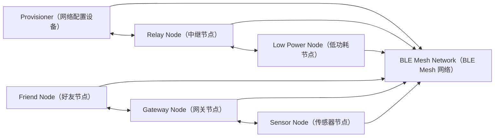

### 3.2 网络组件

| 组件类型 | 功能描述 |
|----------|----------|
| **Provisioner** | 网络配置设备，负责将未配置设备加入网络 |
| **Node** | 网络中的基本设备单元，包含一个或多个元素 |
| **Element** | 节点中的功能单元，包含一个或多个模型 |
| **Model** | 定义元素的功能和接口 |
| **Relay Node** | 支持消息中继功能，扩大网络覆盖范围 |
| **Low Power Node (LPN)** | 低功耗设备，定期唤醒接收消息 |
| **Friend Node** | 为低功耗节点存储消息 |
| **Gateway Node** | 连接 BLE Mesh 网络与其他网络（如 Wi-Fi、以太网） |

### 3.3 地址类型

| 地址类型 | 描述 | 范围 |
|----------|------|------|
| **单播地址** | 单个元素的唯一标识 | 0x0001 - 0x7FFF |
| **组播地址** | 多个元素共享的地址 | 0xC000 - 0xFEFF |
| **虚拟地址** | 基于标签的组播地址 | 0x8000 - 0xBFFF |
| **广播地址** | 所有节点都能接收的地址 | 0xFFFF |

## 4. BLE Mesh 配网流程

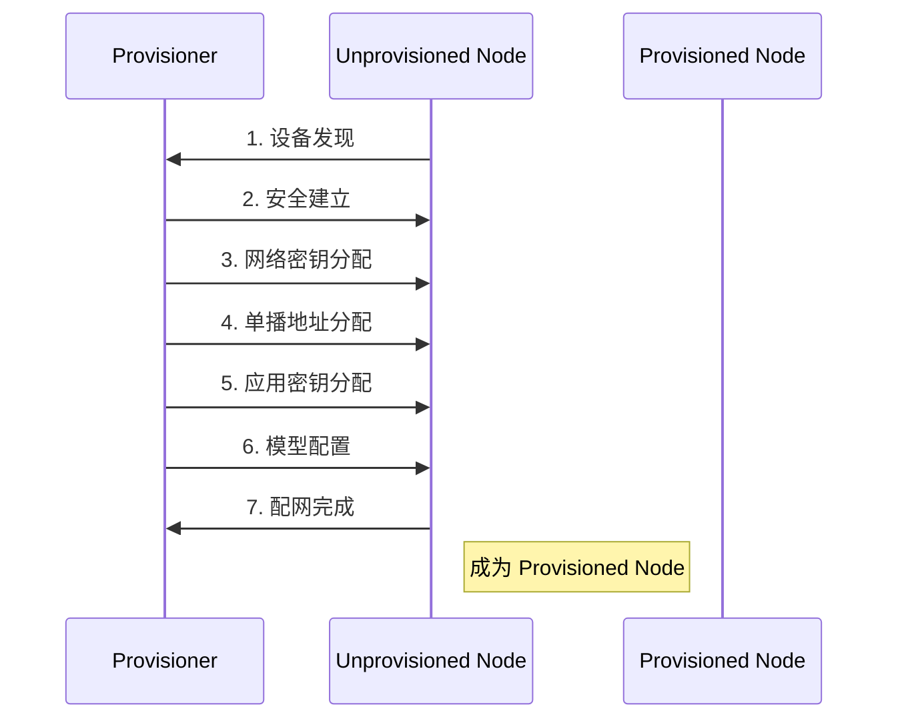

## 5. BLE Mesh 通信机制

### 5.1 消息类型

| 消息类型 | 描述 |
|----------|------|
| **GET** | 请求获取设备状态或数据 |
| **SET** | 设置设备状态或参数 |
| **STATUS** | 响应 GET 或 SET 请求的状态消息 |
| **PUBLISH** | 主动发布的状态消息 |

### 5.2 通信模式

#### 5.2.1 发布/订阅模式

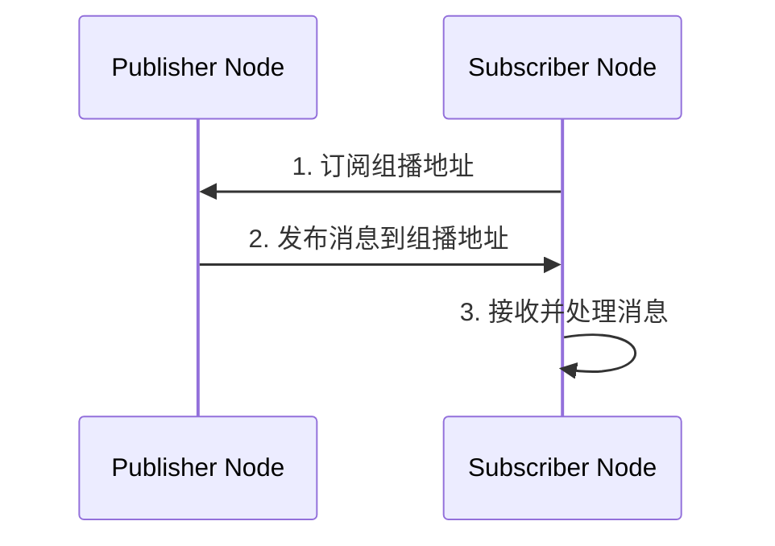

#### 5.2.2 单播通信模式

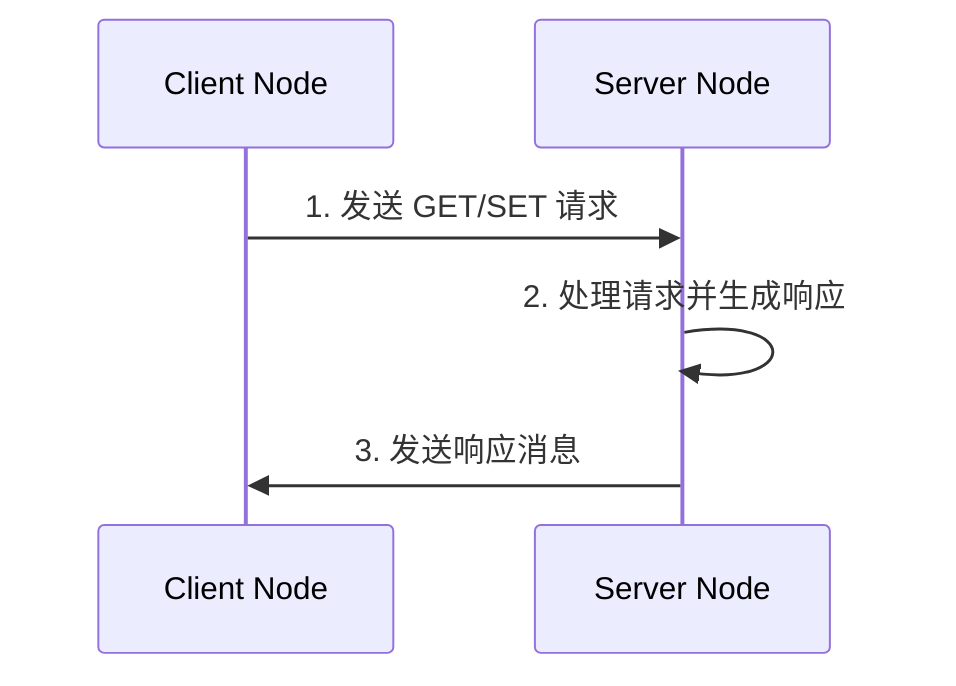

## 6. BLE Mesh 模型架构

### 6.1 模型类型

| 模型类型 | 描述 |
|----------|------|
| **Server Model** | 提供数据和功能的模型 |
| **Client Model** | 请求数据和功能的模型 |
| **Control Model** | 控制其他模型的模型 |
| **Sensor Model** | 提供传感器数据的模型 |

### 6.2 核心通用模型

| 模型名称 | 主要功能 |
|----------|----------|
| **Generic OnOff** | 开关控制 |
| **Generic Level** | 亮度/级别控制 |
| **Generic Default Transition Time** | 默认过渡时间 |
| **Generic Power OnOff** | 上电状态控制 |
| **Generic Power Level** | 功率级别控制 |

### 6.3 照明模型

| 模型名称 | 主要功能 |
|----------|----------|
| **Light Lightness** | 亮度控制 |
| **Light CTL** | 色温和色调控制 |
| **Light HSL** | 色相、饱和度和亮度控制 |
| **Light xyL** | 色度坐标控制 |
| **Light LC** | 灯光控制 |

## 7. BLE Mesh 安全架构

### 7.1 密钥层级

```mermaid
flowchart TD
    DevKey[设备密钥 DevKey]
    NetKey[网络密钥 NetKey]
    AppKey1[应用密钥 1]
    AppKey2[应用密钥 2]
    Model1[模型 1]
    Model2[模型 2]

    DevKey --> NetKey
    NetKey --> AppKey1
    NetKey --> AppKey2
    AppKey1 --> Model1
    AppKey2 --> Model2
```

### 7.2 安全功能

| 安全功能 | 描述 |
|----------|------|
| **加密** | 保护数据 confidentiality |
| **完整性** | 防止数据篡改 |
| **认证** | 验证消息来源 |
| **新鲜性** | 防止重放攻击 |
| **密钥分离** | 不同功能使用不同密钥 |

## 8. BLE Mesh 性能特性

### 8.1 网络规模
- 支持最多 32767 个节点
- 每个节点支持最多 16 个元素
- 每个元素支持多个模型

### 8.2 通信性能
- 消息延迟：单跳 < 100ms
- 网络吞吐量：取决于节点数量和消息频率
- 通信距离：取决于环境，通常 10-30 米

### 8.3 功耗特性
- 支持低功耗模式
- 低功耗节点可使用纽扣电池供电数年
- 中继节点需要持续供电

## 9. BLE Mesh 应用场景

### 9.1 智能家居
- 智能照明系统
- 智能家居控制
- 环境监测网络

### 9.2 工业自动化
- 传感器网络
- 设备监控
- 工业照明

### 9.3 商业应用
- 商业照明系统
- 室内定位
- 资产管理

### 9.4 医疗健康
- 医疗设备网络
- 健康监测系统
- 远程医疗

## 10. BLE Mesh 协议演进

### 10.1 版本历史
- **BLE Mesh 1.0**：2017 年发布，基础功能
- **BLE Mesh 1.1**：2019 年发布，增强功能
- **BLE Mesh 1.2**：2023 年发布，新模型和功能

### 10.2 主要增强
- 支持更多模型类型
- 增强安全特性
- 改进低功耗性能
- 扩展应用场景

## 11. 总结

BLE Mesh 是一种灵活、可扩展的低功耗无线网络协议，通过分层架构设计实现了多对多的通信能力。其 7 层协议栈从物理层到模型层提供了完整的通信功能，支持各种应用场景。网络采用发布/订阅和单播通信模式，结合强大的安全机制，确保数据可靠传输。

BLE Mesh 协议的通用架构为不同硬件平台和应用场景提供了统一的标准，促进了设备互操作性和生态系统发展。

# nRF Mesh 安卓软件使用指南

## 1. nRF Mesh 软件简介

nRF Mesh 是 Nordic Semiconductor 开发的一款专业 BLE Mesh 配置和控制应用，可在 Google Play 商店下载。它支持以下主要功能：

- **BLE Mesh 网络管理**：创建、配置和管理 BLE Mesh 网络
- **设备配置**：配置 BLE Mesh 设备，分配网络密钥和地址
- **模型控制**：支持多种 BLE Mesh 模型，如 Generic OnOff、Generic Level 等
- **网络可视化**：直观显示 BLE Mesh 网络拓扑
- **群组管理**：创建和管理设备群组

## 2. 与 ESP32 BLE Mesh OnOff Server 配合使用

### 2.1 准备工作

1. **硬件准备**：
   - ESP32 开发板（如 ESP32-DevKitC）
   - 安卓手机（支持 BLE 4.2 或更高版本）

2. **软件准备**：
   - 在手机上安装 nRF Mesh 应用（从 Google Play 商店下载）
   - 编译并烧录本示例程序到 ESP32 开发板

### 2.2 程序修改说明

本示例程序已经针对 nRF Mesh 应用进行了优化：

```c
/* Disable OOB security for nRF Mesh Android app */
static esp_ble_mesh_prov_t provision = {
    .uuid = dev_uuid,
    .output_size = 0,
    .output_actions = 0,
};
```

该配置禁用了 OOB（Out-of-Band）安全机制，便于使用 nRF Mesh 应用进行配置。

### 2.3 使用步骤

#### 2.3.1 启动 ESP32 设备

烧录程序后，ESP32 开发板将：
- 初始化 BLE Mesh 子系统
- 打开绿色 LED（表示设备已准备好配置）
- 开始广播，等待 Provisioner 连接

#### 2.3.2 配置 nRF Mesh 应用

1. **打开 nRF Mesh 应用**，点击 "Get Started"。

2. **创建新网络**：
   - 点击 "Create New Network"
   - 输入网络名称，点击 "Create"

3. **配置设备**：
   - 点击右下角的 "+" 按钮
   - 选择 "Provision Devices"
   - 应用将搜索附近的未配置 BLE Mesh 设备
   - 找到 ESP32 设备（通常显示为 "ESP_BLE_MESH" 或类似名称）
   - 点击设备名称进行配置

4. **配置过程**：
   - 应用将自动完成设备配置过程
   - 配置完成后，绿色 LED 将关闭
   - 设备将出现在应用的设备列表中

#### 2.3.3 控制设备

1. **查看设备**：
   - 在主界面上可以看到已配置的设备
   - 点击设备进入控制界面

2. **控制 OnOff 状态**：
   - 在控制界面上找到 OnOff 控制按钮
   - 点击按钮可以切换 LED 灯的开关状态
   - 应用将显示当前 LED 灯的状态

3. **创建群组**（可选）：
   - 点击 "Groups" 标签
   - 点击右下角的 "+" 按钮创建新群组
   - 选择要添加到群组的设备
   - 通过群组可以同时控制多个设备

## 3. 高级功能

### 3.1 模型配置

nRF Mesh 应用支持配置 BLE Mesh 模型的各种参数：

- **应用密钥绑定**：将应用密钥绑定到特定模型
- **订阅配置**：配置模型的组播地址订阅
- **发布配置**：配置模型的发布地址和参数

### 3.2 网络诊断

nRF Mesh 应用提供了网络诊断功能：

- **网络拓扑图**：显示设备之间的连接关系
- **信号强度**：显示设备之间的信号强度
- **消息统计**：统计网络中的消息数量和成功率

### 3.3 固件升级

nRF Mesh 应用支持 Over-the-Air (OTA) 固件升级：

- 上传新的固件文件
- 选择要升级的设备
- 监控升级进度

## 4. 常见问题与解决方案

### 4.1 设备无法被发现

**问题**：nRF Mesh 应用无法发现 ESP32 设备。

**解决方案**：
- 确保 ESP32 开发板已正确烧录程序
- 确保绿色 LED 已打开（表示设备已准备好配置）
- 确保手机蓝牙已打开，并且在设备附近
- 尝试重启 ESP32 开发板和手机

### 4.2 配置失败

**问题**：设备配置过程失败。

**解决方案**：
- 确保手机与 ESP32 设备距离较近
- 确保手机蓝牙版本支持 BLE 4.2 或更高版本
- 尝试重启 ESP32 开发板和手机
- 检查程序中是否正确配置了 OOB 安全机制

### 4.3 控制命令无效

**问题**：发送控制命令后，LED 灯状态没有变化。

**解决方案**：
- 确保设备已正确配置
- 确保应用密钥已正确绑定到 OnOff 模型
- 检查 ESP32 开发板上的 LED 连接是否正确
- 查看 ESP32 开发板的串口日志，检查是否有错误信息

## 5. 与其他 Provisioner 应用的比较

| 功能 | nRF Mesh | SILabs Mesh | Espressif Mesh |
|------|----------|-------------|----------------|
| 易用性 | ⭐⭐⭐⭐⭐ | ⭐⭐⭐⭐ | ⭐⭐⭐ |
| 功能完整性 | ⭐⭐⭐⭐⭐ | ⭐⭐⭐⭐ | ⭐⭐⭐ |
| 兼容性 | ⭐⭐⭐⭐⭐ | ⭐⭐⭐ | ⭐⭐⭐ |
| 文档完善度 | ⭐⭐⭐⭐⭐ | ⭐⭐⭐ | ⭐⭐ |
| 社区支持 | ⭐⭐⭐⭐⭐ | ⭐⭐⭐ | ⭐⭐⭐ |

## 6. 总结

nRF Mesh 是一款功能强大的 BLE Mesh 配置和控制应用，非常适合与 ESP32 BLE Mesh OnOff Server 示例配合使用。通过本指南，您可以快速上手使用 nRF Mesh 应用配置和控制 ESP32 BLE Mesh 设备。

如果您需要更多高级功能，可以参考 nRF Mesh 应用的官方文档：[nRF Mesh Documentation](https://infocenter.nordicsemi.com/topic/com.nordic.infocenter.meshsdk.v4.3.0/mesh_app_intro.html)

## 7. 附加资源

- [nRF Mesh 应用下载](https://play.google.com/store/apps/details?id=no.nordicsemi.android.nrfmeshprovisioner)
- [ESP32 BLE Mesh 官方文档](https://docs.espressif.com/projects/esp-idf/en/latest/esp32/api-reference/bluetooth/esp_ble_mesh.html)
- [BLE Mesh 规范](https://www.bluetooth.com/specifications/mesh-specifications/)
# 电脑端BLE Mesh调试配置工具指南

## 1. 概述

BLE Mesh网络的调试和配置不仅可以通过移动设备完成，也有多种功能强大的电脑端工具可供使用。这些工具通常提供更丰富的功能和更便捷的操作界面，特别适合开发人员进行调试和测试。

本文档将介绍几种常用的电脑端BLE Mesh调试配置工具，包括它们的主要功能、安装方法和使用步骤。

## 2. 推荐工具

### 2.1 nRF Connect for Desktop - Mesh

**功能特点**：
- 由 Nordic Semiconductor 开发的专业 BLE Mesh 工具
- 支持网络创建、设备配置、模型控制等完整功能
- 提供网络拓扑可视化
- 支持抓包和日志分析
- 兼容多种 BLE Mesh 设备

**支持平台**：Windows、macOS、Linux

**获取方式**：
- 下载地址：[nRF Connect for Desktop](https://www.nordicsemi.com/Products/Development-tools/nRF-Connect-for-desktop)

**使用方法**：
1. 安装 nRF Connect for Desktop
2. 在应用中安装 Mesh 插件
3. 连接蓝牙适配器
4. 创建新的 BLE Mesh 网络
5. 搜索并配置 ESP32 BLE Mesh 设备
6. 使用图形界面控制设备和查看状态

### 2.2 Silicon Labs Simplicity Studio - Mesh Configurator

**功能特点**：
- 由 Silicon Labs 开发的综合性 IoT 开发工具
- 内置 Mesh Configurator 用于 BLE Mesh 网络管理
- 支持设备配置、网络分析和固件升级
- 提供详细的网络诊断信息
- 支持多种 Silicon Labs 和第三方设备

**支持平台**：Windows、macOS、Linux

**获取方式**：
- 下载地址：[Simplicity Studio](https://www.silabs.com/developers/simplicity-studio)

**使用方法**：
1. 安装 Simplicity Studio
2. 配置开发环境和蓝牙适配器
3. 打开 Mesh Configurator
4. 创建或导入 BLE Mesh 网络
5. 发现并配置 ESP32 BLE Mesh 设备
6. 管理网络参数和设备模型

### 2.3 Texas Instruments BLE Mesh Visualizer

**功能特点**：
- 由 Texas Instruments 开发的 BLE Mesh 可视化工具
- 支持网络配置、设备管理和模型控制
- 提供直观的网络拓扑图
- 支持实时状态监控和数据记录
- 兼容 TI 和第三方 BLE Mesh 设备

**支持平台**：Windows

**获取方式**：
- 下载地址：[TI BLE Mesh Visualizer](https://www.ti.com/tool/BLE-MESH-VISUALIZER)

**使用方法**：
1. 安装 BLE Mesh Visualizer
2. 连接 TI 蓝牙适配器或兼容设备
3. 创建或打开 BLE Mesh 网络
4. 搜索并配置 ESP32 设备
5. 使用可视化界面控制设备

### 2.4 ESP-IDF 命令行工具

**功能特点**：
- ESP32 官方开发框架提供的工具链
- 支持 BLE Mesh 设备的编译、烧录和调试
- 提供丰富的命令行接口
- 支持日志输出和错误分析
- 与 ESP32 BLE Mesh 示例完美兼容

**支持平台**：Windows、macOS、Linux

**获取方式**：
- 下载地址：[ESP-IDF](https://docs.espressif.com/projects/esp-idf/en/latest/esp32/get-started/index.html)

**使用方法**：
1. 安装 ESP-IDF 开发环境
2. 编译并烧录 BLE Mesh 示例程序
3. 使用 `idf.py monitor` 查看设备日志
4. 通过串口或网络接口与设备交互
5. 使用 `menuconfig` 配置 BLE Mesh 参数

### 2.5 Wireshark with BLE Mesh Plugin

**功能特点**：
- 强大的网络协议分析工具
- 支持 BLE Mesh 协议解析
- 提供详细的数据包分析
- 支持实时抓包和离线分析
- 兼容各种 BLE 适配器

**支持平台**：Windows、macOS、Linux

**获取方式**：
1. 下载并安装 Wireshark
2. 确保安装 BLE 相关插件
3. 对于 BLE Mesh 高级分析，可能需要安装额外插件

**使用方法**：
1. 配置蓝牙适配器为可抓包模式
2. 启动 Wireshark 并选择蓝牙接口
3. 设置过滤条件捕获 BLE Mesh 数据包
4. 分析数据包结构和内容
5. 定位和解决网络问题

## 3. 与 ESP32 BLE Mesh OnOff Server 配合使用

### 3.1 设备准备

1. 确保 ESP32 开发板已烧录 BLE Mesh OnOff Server 示例程序
2. 设备启动后，绿色 LED 亮起表示已准备好配置
3. 确保电脑蓝牙适配器支持 BLE 4.2 或更高版本

### 3.2 通用配置步骤

1. **启动电脑端工具**并连接蓝牙适配器
2. **创建新网络**或打开现有网络
3. **搜索设备**，找到 ESP32 BLE Mesh 设备
4. **配置设备**：
   - 分配网络密钥
   - 分配设备地址
   - 配置应用密钥
   - 设置模型订阅
5. **控制设备**：使用工具界面发送 OnOff 命令控制 LED 灯

### 3.3 特别注意事项

- 确保电脑端工具与 ESP32 设备使用相同的 BLE Mesh 协议版本
- 对于某些工具，可能需要禁用 OOB 安全机制（本示例已默认禁用）
- 如遇到连接问题，可尝试重启设备和工具

## 4. 功能对比

| 工具名称 | 主要优势 | 适用场景 | 易用性 | 功能完整性 |
|---------|---------|---------|-------|-----------|
| nRF Connect for Desktop - Mesh | 界面友好，功能全面 | 开发调试、网络管理 | ⭐⭐⭐⭐⭐ | ⭐⭐⭐⭐⭐ |
| Silicon Labs Simplicity Studio | 综合性强，诊断功能丰富 | 专业开发、网络分析 | ⭐⭐⭐⭐ | ⭐⭐⭐⭐⭐ |
| Texas Instruments BLE Mesh Visualizer | 可视化效果好 | 演示、教学、网络监控 | ⭐⭐⭐⭐ | ⭐⭐⭐⭐ |
| ESP-IDF 命令行工具 | 与 ESP32 完美兼容 | 开发调试、自动化测试 | ⭐⭐⭐ | ⭐⭐⭐⭐ |
| Wireshark | 数据包级分析 | 网络调试、问题定位 | ⭐⭐⭐ | ⭐⭐⭐⭐⭐ |

## 5. 选择建议

根据不同需求选择合适的工具：

- **开发调试**：nRF Connect for Desktop - Mesh
- **专业分析**：Silicon Labs Simplicity Studio
- **可视化演示**：Texas Instruments BLE Mesh Visualizer
- **ESP32 专属开发**：ESP-IDF 命令行工具
- **网络问题定位**：Wireshark

## 6. 常见问题与解决方案

### 6.1 设备无法被发现

**问题**：电脑端工具无法发现 ESP32 BLE Mesh 设备。

**解决方案**：
- 确保设备已正确烧录程序并处于可配置状态
- 检查电脑蓝牙适配器是否正常工作
- 确保设备与电脑距离较近
- 尝试重启设备和工具

### 6.2 配置失败

**问题**：设备配置过程中出现错误。

**解决方案**：
- 确保使用正确的网络密钥和设备地址
- 检查工具与设备的 BLE Mesh 协议版本兼容性
- 确保设备已正确初始化
- 查看设备日志获取详细错误信息

### 6.3 控制命令无效

**问题**：发送控制命令后，设备无响应。

**解决方案**：
- 检查应用密钥是否正确绑定到模型
- 确保设备已订阅正确的组播地址
- 检查网络连接和信号强度
- 查看设备日志确认是否收到命令

## 7. 总结

电脑端BLE Mesh调试配置工具提供了丰富的功能和便捷的操作界面，非常适合开发人员进行BLE Mesh网络的开发、调试和测试。根据不同的需求和使用场景，可以选择合适的工具来提高开发效率和解决问题。

对于ESP32 BLE Mesh OnOff Server示例程序，推荐使用nRF Connect for Desktop - Mesh工具，它提供了完整的功能和友好的界面，能够快速完成设备配置和控制。

## 8. 附加资源

- [BLE Mesh 官方规范](https://www.bluetooth.com/specifications/mesh-specifications/)
- [ESP32 BLE Mesh 官方文档](https://docs.espressif.com/projects/esp-idf/en/latest/esp32/api-reference/bluetooth/esp_ble_mesh.html)
- [nRF Mesh 工具文档](https://infocenter.nordicsemi.com/topic/com.nordic.infocenter.meshsdk.v4.3.0/mesh_app_intro.html)
