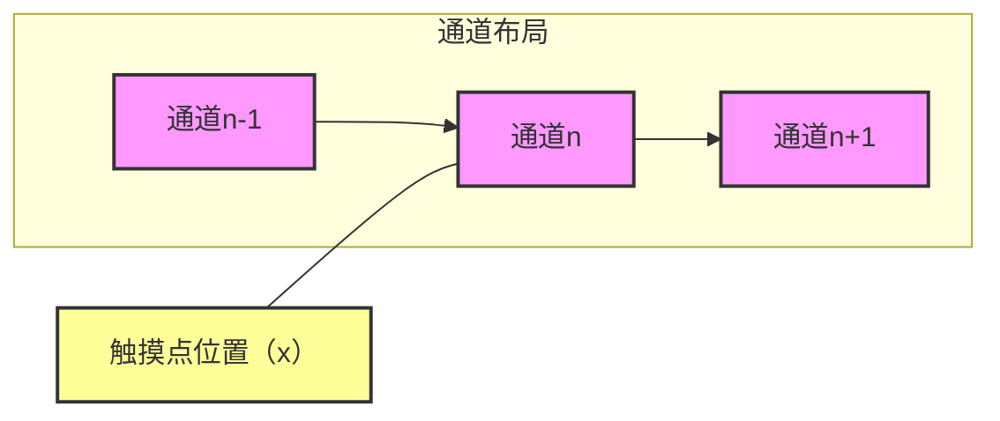
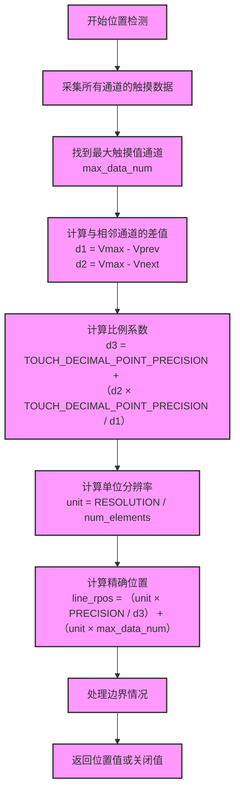

# 触摸位置检测算法详解：三角定位与比例计算

## 1. 算法概述

触摸位置检测算法是实现高精度触摸控制的核心技术，通过分析多个触摸通道的信号分布，可以将触摸位置的分辨率从通道数量级提高到更高的精度。本文将详细解释基于相邻通道差值的三角定位原理和比例计算方法。

## 2. 触摸信号分布特性

### 2.1 单点触摸的信号分布

当手指触摸线性滑条时，触摸信号呈现以下特性：

- **信号峰值**：触摸点正下方的通道会检测到最大的触摸值
- **衰减分布**：信号从触摸点向两侧逐渐衰减
- **线性关系**：相邻通道间的信号衰减通常呈现线性关系

### 2.2 多通道信号示例

假设一个线性滑条有5个通道（0-4），当触摸点位于通道2和3之间时，各通道的典型触摸值分布可能如下：

| 通道号 | 0 | 1  | 2  | 3  | 4 |
| --- | - | -- | -- | -- | - |
| 触摸值 | 5 | 15 | 30 | 22 | 8 |

## 3. 三角定位原理

### 3.1 基本思想

三角定位算法的核心思想是：

1. 找到信号峰值通道（最大触摸值的通道）
2. 以峰值通道为中心，分析与相邻通道的信号差值
3. 根据差值比例计算触摸点在通道间的精确位置

### 3.2 数学模型

#### 3.2.1 几何模型



#### 3.2.2 信号衰减模型

触摸信号强度与距离的关系可以近似表示为：

$$ V(d) = V\_0 \times e^{-kd} $$

其中：

- V(d) ：距离触摸点d处的信号强度
- V\_0 ：触摸点处的最大信号强度
- k ：衰减系数

对于相邻通道，由于距离较短，可以近似为线性衰减：

$$ V(d) \approx V\_0 - kd $$

## 4. 比例计算详解

### 4.1 关键变量定义

| 变量             | 含义           | 计算方法                                                                                 |
| -------------- | ------------ | ------------------------------------------------------------------------------------ |
| `max_data_num` | 最大触摸值通道号     | 遍历所有通道找到最大值                                                                          |
| `d1`           | 中心通道与前一通道的差值 | V\_{max} - V\_{max-1}                                                                |
| `d2`           | 中心通道与后一通道的差值 | V\_{max} - V\_{max+1}                                                                |
| `d3`           | 比例系数         | TOUCH\_DECIMAL\_POINT\_PRECISION + (d2 \times TOUCH\_DECIMAL\_POINT\_PRECISION / d1) |

### 4.2 比例系数d3的物理意义

`d3`反映了触摸点偏离中心通道的程度：

- 当`d2 ≈ d1`时，`d3 ≈ 2 × TOUCH_DECIMAL_POINT_PRECISION`，表示触摸点大致在中心通道正下方
- 当`d2 > d1`时，`d3 > 2 × TOUCH_DECIMAL_POINT_PRECISION`，表示触摸点更靠近前一通道
- 当`d2 < d1`时，`d3 < 2 × TOUCH_DECIMAL_POINT_PRECISION`，表示触摸点更靠近后一通道

### 4.3 定点运算的意义

`TOUCH_DECIMAL_POINT_PRECISION`（通常为100）用于实现定点运算：

- 避免浮点数运算，提高嵌入式系统性能
- 保留足够的精度，确保位置计算的准确性

## 5. 精确位置计算

### 5.1 单位分辨率计算

$$ unit = \frac{TOUCH\_LINE\_SLIDER\_RESOLUTION}{num\_elements} $$

其中：

- `TOUCH_LINE_SLIDER_RESOLUTION`：总分辨率（如100）
- `num_elements`：通道数量

### 5.2 精确位置公式

$$ line\_rpos = \frac{unit \times TOUCH\_DECIMAL\_POINT\_PRECISION}{d3} + (unit \times max\_data\_num) $$

#### 5.2.1 公式解析

- `unit × max_data_num`：计算中心通道的基准位置
- `(unit × TOUCH_DECIMAL_POINT_PRECISION) / d3`：计算在当前通道内的精确偏移量
- 两者相加得到最终的精确位置

### 5.3 边界情况处理

- **位置小于1**：调整为1（最小有效值）
- **位置大于总分辨率**：调整为总分辨率值
- **无有效触摸**：返回`TOUCH_LINE_OFF_VALUE`（通常为0xFFFF）

## 6. 算法实现流程图



## 7. Python演示程序

### 7.1 程序功能

- 模拟触摸信号分布
- 实现完整的位置检测算法
- 可视化信号分布和计算结果

### 7.2 代码实现

```python

"""
触摸位置检测算法：图形界面演示

使用Tkinter实现图形界面，可视化展示触摸信号分布和位置检测过程
"""

import tkinter as tk
from tkinter import ttk, messagebox
import math

# 算法参数
TOUCH_DECIMAL_POINT_PRECISION = 100  # 定点运算精度
TOUCH_LINE_SLIDER_RESOLUTION = 100   # 总分辨率


class TouchPositioningDemo:
    def __init__(self, root):
        self.root = root
        self.root.title("触摸位置检测算法演示")
        self.root.geometry("900x700")
        self.root.minsize(800, 600)
        self.root.resizable(True, True)
        
        # 设置字体
        self.font_normal = ("Arial", 10)
        self.font_bold = ("Arial", 10, "bold")
        self.font_title = ("Arial", 12, "bold")
        
        # 触摸参数
        self.num_channels = 5
        self.actual_position = 0.6  # 0-1范围内的实际触摸位置
        self.touch_values = []
        self.detected_position = 0
        
        # 创建界面
        self.create_widgets()
        
        # 初始计算和显示
        self.update_demo()
    
    def create_widgets(self):
        # 创建主框架
        main_frame = ttk.Frame(self.root, padding="10")
        main_frame.grid(row=0, column=0, sticky=(tk.W, tk.E, tk.N, tk.S))
        
        # 配置行列权重
        self.root.grid_rowconfigure(0, weight=1)
        self.root.grid_columnconfigure(0, weight=1)
        main_frame.grid_rowconfigure(0, weight=0)
        main_frame.grid_rowconfigure(1, weight=1)
        main_frame.grid_rowconfigure(2, weight=1)
        main_frame.grid_columnconfigure(0, weight=1)
        
        # 创建左侧控制面板
        control_frame = ttk.LabelFrame(main_frame, text="控制参数", padding="10")
        control_frame.grid(row=0, column=0, sticky=(tk.W, tk.E, tk.N), pady=5)
        
        # 触摸位置滑块
        ttk.Label(control_frame, text="触摸位置 (0-1):", font=self.font_normal).grid(row=0, column=0, sticky=tk.W, pady=5)
        self.position_var = tk.DoubleVar(value=self.actual_position)
        self.position_slider = ttk.Scale(control_frame, from_=0, to=1, orient=tk.HORIZONTAL,
                                         variable=self.position_var, command=self.on_position_change)
        self.position_slider.grid(row=0, column=1, sticky=(tk.W, tk.E), pady=5, padx=5)
        self.position_label = ttk.Label(control_frame, text=f"{self.actual_position:.2f}", font=self.font_bold)
        self.position_label.grid(row=0, column=2, sticky=tk.W, pady=5)
        
        # 通道数量
        ttk.Label(control_frame, text="通道数量:", font=self.font_normal).grid(row=1, column=0, sticky=tk.W, pady=5)
        self.num_channels_var = tk.IntVar(value=self.num_channels)
        self.num_channels_spin = ttk.Spinbox(control_frame, from_=3, to=10, textvariable=self.num_channels_var,
                                             command=self.on_channels_change, width=5)
        self.num_channels_spin.grid(row=1, column=1, sticky=tk.W, pady=5, padx=5)
        
        # 算法参数
        ttk.Separator(control_frame, orient=tk.HORIZONTAL).grid(row=2, column=0, columnspan=3, sticky=(tk.W, tk.E), pady=10)
        ttk.Label(control_frame, text="算法参数:", font=self.font_bold).grid(row=3, column=0, sticky=tk.W, pady=5)
        
        # 信号扩散宽度 (sigma)
        ttk.Label(control_frame, text="信号扩散宽度:", font=self.font_normal).grid(row=4, column=0, sticky=tk.W, pady=5)
        self.sigma_var = tk.DoubleVar(value=0.15)
        self.sigma_slider = ttk.Scale(control_frame, from_=0.05, to=0.3, orient=tk.HORIZONTAL,
                                      variable=self.sigma_var, command=self.on_sigma_change)
        self.sigma_slider.grid(row=4, column=1, sticky=(tk.W, tk.E), pady=5, padx=5)
        self.sigma_label = ttk.Label(control_frame, text="0.15", font=self.font_bold)
        self.sigma_label.grid(row=4, column=2, sticky=tk.W, pady=5)
        
        # 动画控制
        ttk.Separator(control_frame, orient=tk.HORIZONTAL).grid(row=5, column=0, columnspan=3, sticky=(tk.W, tk.E), pady=10)
        ttk.Label(control_frame, text="动画演示:", font=self.font_bold).grid(row=6, column=0, sticky=tk.W, pady=5)
        
        self.animation_var = tk.BooleanVar(value=False)
        self.animation_button = ttk.Button(control_frame, text="开始动画", command=self.toggle_animation)
        self.animation_button.grid(row=7, column=0, columnspan=3, sticky=(tk.W, tk.E), pady=5)
        
        self.animation_direction = 1  # 1: 向右, -1: 向左
        
        # 创建可视化区域框架
        visualization_container = ttk.Frame(main_frame)
        visualization_container.grid(row=1, column=0, sticky=(tk.W, tk.E, tk.N, tk.S), pady=5)
        visualization_container.grid_rowconfigure(0, weight=1)
        visualization_container.grid_columnconfigure(0, weight=1)
        visualization_container.grid_columnconfigure(1, weight=1)
        
        # 创建左侧主可视化区域
        visualization_frame = ttk.LabelFrame(visualization_container, text="触摸信号与算法原理", padding="10")
        visualization_frame.grid(row=0, column=0, sticky=(tk.W, tk.E, tk.N, tk.S), padx=(0, 5))
        visualization_frame.grid_rowconfigure(0, weight=1)
        visualization_frame.grid_columnconfigure(0, weight=1)
        
        # 创建主画布
        self.canvas = tk.Canvas(visualization_frame, bg="white", width=400, height=400)
        self.canvas.grid(row=0, column=0, sticky=(tk.W, tk.E, tk.N, tk.S))
        
        # 创建右侧额外可视化区域
        extra_vis_frame = ttk.LabelFrame(visualization_container, text="额外分析图表", padding="10")
        extra_vis_frame.grid(row=0, column=1, sticky=(tk.W, tk.E, tk.N, tk.S), padx=(5, 0))
        extra_vis_frame.grid_rowconfigure(0, weight=1)
        extra_vis_frame.grid_rowconfigure(1, weight=1)
        extra_vis_frame.grid_columnconfigure(0, weight=1)
        
        # 创建误差曲线画布
        self.error_canvas = tk.Canvas(extra_vis_frame, bg="white", width=350, height=150)
        self.error_canvas.grid(row=0, column=0, sticky=(tk.W, tk.E, tk.N, tk.S), pady=(0, 5))
        
        # 创建比例计算画布
        self.ratio_canvas = tk.Canvas(extra_vis_frame, bg="white", width=350, height=150)
        self.ratio_canvas.grid(row=1, column=0, sticky=(tk.W, tk.E, tk.N, tk.S), pady=(5, 0))
        
        # 创建计算过程显示
        calculation_frame = ttk.LabelFrame(main_frame, text="计算过程", padding="10")
        calculation_frame.grid(row=2, column=0, sticky=(tk.W, tk.E), pady=5)
        calculation_frame.grid_columnconfigure(0, weight=1)
        
        # 创建文本框显示计算过程
        self.calculation_text = tk.Text(calculation_frame, font=self.font_normal, height=15, wrap=tk.WORD)
        self.calculation_text.grid(row=0, column=0, sticky=(tk.W, tk.E))
        
        # 添加滚动条
        scrollbar = ttk.Scrollbar(calculation_frame, orient=tk.VERTICAL, command=self.calculation_text.yview)
        scrollbar.grid(row=0, column=1, sticky=(tk.N, tk.S))
        self.calculation_text.config(yscrollcommand=scrollbar.set)
        
    def simulate_touch_signals(self, num_elements, touch_position):
        """
        模拟触摸信号分布
        """
        # 生成信号分布
        touch_values = []
        for i in range(num_elements):
            # 使用高斯分布模拟信号
            pos = i / (num_elements - 1)
            sigma = self.sigma_var.get()
            value = math.exp(-((pos - touch_position) ** 2) / (2 * sigma ** 2)) * 50
            # 添加少量噪声
            value += (i % 3 - 1)  # 简单的伪噪声
            touch_values.append(max(0, int(value)))
        return touch_values
    
    def detect_line_slider_position(self, touch_values):
        """
        检测线性滑条的精确位置
        """
        num_elements = len(touch_values)
        
        # 找到最大触摸值通道
        max_data_num = touch_values.index(max(touch_values))
        
        # 计算相邻通道差值
        if max_data_num == 0:
            d1 = touch_values[0]
            d2 = touch_values[0] - touch_values[1]
        elif max_data_num == num_elements - 1:
            d1 = touch_values[-1] - touch_values[-2]
            d2 = touch_values[-1]
        else:
            d1 = touch_values[max_data_num] - touch_values[max_data_num - 1]
            d2 = touch_values[max_data_num] - touch_values[max_data_num + 1]
        
        # 避免除零错误
        if d1 == 0:
            d1 = 1
        
        # 计算比例系数
        d3 = TOUCH_DECIMAL_POINT_PRECISION + ((d2 * TOUCH_DECIMAL_POINT_PRECISION) // d1)
        
        # 计算单位分辨率
        unit = TOUCH_LINE_SLIDER_RESOLUTION // num_elements
        
        # 计算精确位置
        offset = (unit * TOUCH_DECIMAL_POINT_PRECISION) // d3
        base_position = unit * max_data_num
        line_rpos = offset + base_position
        
        # 处理边界情况
        if line_rpos < 1:
            line_rpos = 1
        elif line_rpos > TOUCH_LINE_SLIDER_RESOLUTION:
            line_rpos = TOUCH_LINE_SLIDER_RESOLUTION
        
        return line_rpos, max_data_num, d1, d2, d3, unit
    
    def draw_visualization(self):
        """
        绘制触摸信号可视化
        """
        self.canvas.delete("all")
        
        # 获取画布尺寸
        width = self.canvas.winfo_width()
        height = self.canvas.winfo_height()
        
        if width < 100 or height < 100:
            return
        
        # 计算绘制参数
        padding = 50
        chart_width = width - 2 * padding
        chart_height = height - 2 * padding
        
        # 计算算法原理展示区域
        algorithm_area_height = 150
        main_chart_height = height - 2 * padding - algorithm_area_height - 20
        
        # 绘制主图表坐标轴
        main_chart_y = height - padding - main_chart_height
        self.canvas.create_line(padding, main_chart_y, padding, height - padding, width=2)
        self.canvas.create_line(padding, height - padding, width - padding, height - padding, width=2)
        
        # 绘制通道和触摸信号
        num_channels = len(self.touch_values)
        if num_channels == 0:
            return
        
        bar_width = chart_width / num_channels * 0.7
        bar_spacing = chart_width / num_channels * 0.3
        max_value = max(self.touch_values) if self.touch_values else 1
        
        # 找到最大触摸值通道
        max_channel = self.touch_values.index(max(self.touch_values))
        
        # 绘制每个通道的柱状图
        for i, value in enumerate(self.touch_values):
            x = padding + i * (bar_width + bar_spacing)
            y = main_chart_y - (value / max_value) * main_chart_height
            
            # 根据通道类型选择颜色
            if i == max_channel:
                fill_color = "orange"
                outline_color = "red"
                outline_width = 2
            elif i == max_channel - 1 or i == max_channel + 1:
                fill_color = "lightgreen"
                outline_color = "green"
                outline_width = 1
            else:
                fill_color = "skyblue"
                outline_color = "blue"
                outline_width = 1
            
            # 绘制柱子
            self.canvas.create_rectangle(x, y, x + bar_width, main_chart_y, 
                                        fill=fill_color, outline=outline_color, width=outline_width)
            
            # 绘制通道号
            self.canvas.create_text(x + bar_width/2, main_chart_y + 15, 
                                  text=f"通道{i}", font=self.font_normal)
            
            # 绘制值
            self.canvas.create_text(x + bar_width/2, y - 10, 
                                  text=str(value), font=self.font_bold)
        
        # 绘制触摸信号曲线
        if num_channels > 1:
            points = []
            for i, value in enumerate(self.touch_values):
                x = padding + i * (bar_width + bar_spacing) + bar_width / 2
                y = main_chart_y - (value / max_value) * main_chart_height
                points.append((x, y))
            
            # 绘制曲线
            self.canvas.create_line(points, fill="purple", width=2)
        
        # 绘制实际触摸位置
        actual_pos_x = padding + self.actual_position * chart_width
        self.canvas.create_line(actual_pos_x, main_chart_y - main_chart_height, actual_pos_x, main_chart_y, 
                              fill="red", width=2, dash=(5, 5))
        self.canvas.create_text(actual_pos_x, main_chart_y - main_chart_height - 10, 
                              text=f"实际位置: {self.actual_position:.2f}", 
                              fill="red", font=self.font_bold)
        
        # 绘制检测位置
        detected_pos_x = padding + (self.detected_position / TOUCH_LINE_SLIDER_RESOLUTION) * chart_width
        self.canvas.create_line(detected_pos_x, main_chart_y - main_chart_height, detected_pos_x, main_chart_y, 
                              fill="green", width=2)
        self.canvas.create_text(detected_pos_x, main_chart_y + 30, 
                              text=f"检测位置: {self.detected_position}", 
                              fill="green", font=self.font_bold)
        
        # 绘制算法原理示意图
        self.draw_algorithm_visualization(padding, algorithm_area_height, chart_width)
    
    def draw_algorithm_visualization(self, padding, height, width):
        """
        绘制算法原理的可视化解释
        """
        # 计算坐标
        y_start = padding
        y_end = y_start + height
        
        # 绘制标题
        self.canvas.create_text(padding + width/2, y_start - 10, 
                              text="算法原理：三角定位与比例计算", 
                              font=self.font_title, fill="darkblue")
        
        # 绘制通道示意图
        channel_spacing = width / 5
        channel_height = 30
        
        # 中心通道（橙色）
        center_x = padding + channel_spacing * 2
        self.canvas.create_rectangle(center_x - 20, y_start + 10, center_x + 20, y_start + 10 + channel_height,
                                   fill="orange", outline="red", width=2)
        self.canvas.create_text(center_x, y_start + 10 + channel_height/2, 
                              text="通道N", font=self.font_bold, fill="red")
        
        # 前一通道（浅绿色）
        prev_x = padding + channel_spacing
        self.canvas.create_rectangle(prev_x - 20, y_start + 20, prev_x + 20, y_start + 20 + channel_height,
                                   fill="lightgreen", outline="green")
        self.canvas.create_text(prev_x, y_start + 20 + channel_height/2, 
                              text="通道N-1", font=self.font_normal, fill="green")
        
        # 后一通道（浅绿色）
        next_x = padding + channel_spacing * 3
        self.canvas.create_rectangle(next_x - 20, y_start + 20, next_x + 20, y_start + 20 + channel_height,
                                   fill="lightgreen", outline="green")
        self.canvas.create_text(next_x, y_start + 20 + channel_height/2, 
                              text="通道N+1", font=self.font_normal, fill="green")
        
        # 绘制信号扩散箭头
        self.canvas.create_line(center_x, y_start + 55, center_x, y_start + 75, 
                              fill="purple", width=2, arrow=tk.LAST)
        
        # 绘制三角定位示意图
        triangle_y = y_start + 80
        
        # 绘制三个关键点
        self.canvas.create_oval(center_x - 5, triangle_y - 5, center_x + 5, triangle_y + 5, 
                              fill="red", outline="red")
        self.canvas.create_oval(prev_x - 5, triangle_y + 30 - 5, prev_x + 5, triangle_y + 30 + 5, 
                              fill="green", outline="green")
        self.canvas.create_oval(next_x - 5, triangle_y + 30 - 5, next_x + 5, triangle_y + 30 + 5, 
                              fill="green", outline="green")
        
        # 绘制连线形成三角形
        self.canvas.create_line(center_x, triangle_y, prev_x, triangle_y + 30, 
                              fill="blue", width=2, dash=(3, 3))
        self.canvas.create_line(center_x, triangle_y, next_x, triangle_y + 30, 
                              fill="blue", width=2, dash=(3, 3))
        self.canvas.create_line(prev_x, triangle_y + 30, next_x, triangle_y + 30, 
                              fill="blue", width=2, dash=(3, 3))
        
        # 绘制差值标记
        self.canvas.create_text(center_x - channel_spacing/2, triangle_y + 15, 
                              text="d1", font=self.font_bold, fill="blue")
        self.canvas.create_text(center_x + channel_spacing/2, triangle_y + 15, 
                              text="d2", font=self.font_bold, fill="blue")
        
        # 绘制比例计算说明
        calc_x = padding + channel_spacing * 4
        self.canvas.create_text(calc_x, triangle_y, 
                              text="比例计算", font=self.font_bold, fill="darkgreen")
        self.canvas.create_text(calc_x, triangle_y + 20, 
                              text="d3 = 100 + (d2*100)//d1", font=self.font_normal)
        self.canvas.create_text(calc_x, triangle_y + 40, 
                              text="位置 = 基准 + (单位分辨率*100)//d3", font=self.font_normal)
        
        # 绘制图例
        legend_x = padding
        legend_y = y_start + 120
        
        # 颜色图例
        self.canvas.create_rectangle(legend_x, legend_y, legend_x + 20, legend_y + 15, fill="orange", outline="red", width=2)
        self.canvas.create_text(legend_x + 25, legend_y + 10, text="最大通道", font=self.font_normal)
        
        self.canvas.create_rectangle(legend_x + 100, legend_y, legend_x + 120, legend_y + 15, fill="lightgreen", outline="green")
        self.canvas.create_text(legend_x + 125, legend_y + 10, text="相邻通道", font=self.font_normal)
        
        self.canvas.create_line(legend_x + 200, legend_y, legend_x + 220, legend_y, fill="red", width=2, dash=(5, 5))
        self.canvas.create_text(legend_x + 225, legend_y + 10, text="实际位置", font=self.font_normal)
        
        self.canvas.create_line(legend_x + 300, legend_y, legend_x + 320, legend_y, fill="green", width=2)
        self.canvas.create_text(legend_x + 325, legend_y + 10, text="检测位置", font=self.font_normal)
    
    def update_calculation_text(self, max_data_num, d1, d2, d3, unit):
        """
        更新计算过程文本
        """
        self.calculation_text.delete(1.0, tk.END)
        
        text = "计算过程:\n\n"
        text += "1. 触摸信号分布:\n"
        text += f"   各通道值: {self.touch_values}\n\n"
        
        text += "2. 找到最大触摸值通道:\n"
        text += f"   最大通道号: {max_data_num}, 值: {self.touch_values[max_data_num]}\n\n"
        
        text += "3. 计算相邻通道差值:\n"
        if max_data_num == 0:
            text += f"   特殊处理：第一个通道\n"
            text += f"   d1 = 中心值 = {d1}\n"
            text += f"   d2 = 中心值 - 后一通道 = {d2}\n"
        elif max_data_num == len(self.touch_values) - 1:
            text += f"   特殊处理：最后一个通道\n"
            text += f"   d1 = 中心值 - 前一通道 = {d1}\n"
            text += f"   d2 = 中心值 = {d2}\n"
        else:
            text += f"   d1 = 中心值 - 前一通道 = {self.touch_values[max_data_num]} - {self.touch_values[max_data_num - 1]} = {d1}\n"
            text += f"   d2 = 中心值 - 后一通道 = {self.touch_values[max_data_num]} - {self.touch_values[max_data_num + 1]} = {d2}\n"
        text += "\n"
        
        text += "4. 计算比例系数 (三角定位核心):\n"
        text += f"   d3 = {TOUCH_DECIMAL_POINT_PRECISION} + (d2 * {TOUCH_DECIMAL_POINT_PRECISION} // d1)\n"
        text += f"   d3 = {TOUCH_DECIMAL_POINT_PRECISION} + ({d2 * TOUCH_DECIMAL_POINT_PRECISION} // {d1}) = {d3}\n"
        text += f"   说明：d3值反映触摸点偏离中心通道的程度\n\n"
        
        text += "5. 计算单位分辨率:\n"
        text += f"   unit = {TOUCH_LINE_SLIDER_RESOLUTION} // {len(self.touch_values)} = {unit}\n\n"
        
        text += "6. 计算精确位置:\n"
        text += f"   基准位置 = unit * max_data_num = {unit} * {max_data_num} = {unit * max_data_num}\n"
        offset = (unit * TOUCH_DECIMAL_POINT_PRECISION) // d3
        text += f"   通道内偏移 = (unit * {TOUCH_DECIMAL_POINT_PRECISION}) // d3 = {offset}\n"
        text += f"   最终位置 = 基准位置 + 偏移 = {self.detected_position}\n\n"
        
        text += "7. 结果分析:\n"
        text += f"   实际归一化位置: {self.actual_position:.2f}\n"
        text += f"   检测归一化位置: {self.detected_position / TOUCH_LINE_SLIDER_RESOLUTION:.2f}\n"
        error = abs(self.detected_position - self.actual_position * TOUCH_LINE_SLIDER_RESOLUTION)
        text += f"   位置误差: {error:.2f}\n"
        
        self.calculation_text.insert(1.0, text)
    
    def update_demo(self):
        """
        更新整个演示
        """
        # 获取参数
        self.actual_position = self.position_var.get()
        self.num_channels = self.num_channels_var.get()
        
        # 更新位置显示
        self.position_label.config(text=f"{self.actual_position:.2f}")
        
        # 模拟触摸信号
        self.touch_values = self.simulate_touch_signals(self.num_channels, self.actual_position)
        
        # 检测位置
        result = self.detect_line_slider_position(self.touch_values)
        self.detected_position = result[0]
        
        # 更新可视化
        self.draw_visualization()
        self.draw_error_curve()
        self.draw_ratio_visualization()
        
        # 更新计算过程
        self.update_calculation_text(*result[1:])
    
    def on_position_change(self, event=None):
        """
        触摸位置变化事件
        """
        self.update_demo()
    
    def on_channels_change(self):
        """
        通道数量变化事件
        """
        self.update_demo()
    
    def on_sigma_change(self, event=None):
        """
        信号扩散宽度变化事件
        """
        sigma_value = self.sigma_var.get()
        self.sigma_label.config(text=f"{sigma_value:.2f}")
        self.update_demo()
    
    def toggle_animation(self):
        """
        切换动画状态
        """
        if not self.animation_var.get():
            # 开始动画
            self.animation_var.set(True)
            self.animation_button.config(text="停止动画")
            self.animation_step()
        else:
            # 停止动画
            self.animation_var.set(False)
            self.animation_button.config(text="开始动画")
    
    def animation_step(self):
        """
        动画的每一步
        """
        if self.animation_var.get():
            # 更新触摸位置
            new_position = self.actual_position + 0.01 * self.animation_direction
            
            # 检查边界
            if new_position > 1:
                new_position = 1
                self.animation_direction = -1
            elif new_position < 0:
                new_position = 0
                self.animation_direction = 1
            
            # 更新位置
            self.position_var.set(new_position)
            self.update_demo()
            
            # 继续动画
            self.root.after(100, self.animation_step)
    
    def draw_error_curve(self):
        """
        绘制误差曲线
        """
        self.error_canvas.delete("all")
        
        # 获取画布尺寸
        width = self.error_canvas.winfo_width()
        height = self.error_canvas.winfo_height()
        
        if width < 100 or height < 100:
            return
        
        # 计算绘制参数
        padding = 30
        chart_width = width - 2 * padding
        chart_height = height - 2 * padding
        
        # 绘制标题
        self.error_canvas.create_text(width/2, padding/2, 
                                    text="位置检测误差分析", 
                                    font=self.font_title, fill="darkblue")
        
        # 绘制坐标轴
        self.error_canvas.create_line(padding, padding, padding, height - padding, width=2)
        self.error_canvas.create_line(padding, height - padding, width - padding, height - padding, width=2)
        
        # 计算不同位置的误差
        positions = []
        errors = []
        
        for i in range(0, 101, 5):
            pos = i / 100
            touch_values = self.simulate_touch_signals(self.num_channels, pos)
            detected_pos, _, _, _, _, _ = self.detect_line_slider_position(touch_values)
            actual_pos_value = pos * TOUCH_LINE_SLIDER_RESOLUTION
            error = abs(detected_pos - actual_pos_value)
            positions.append(pos)
            errors.append(error)
        
        # 绘制误差曲线
        max_error = max(errors) if errors else 1
        points = []
        for i, (pos, error) in enumerate(zip(positions, errors)):
            x = padding + pos * chart_width
            y = height - padding - (error / max_error) * chart_height
            points.append((x, y))
        
        if points:
            self.error_canvas.create_line(points, fill="red", width=2)
        
        # 绘制当前误差点
        current_error = abs(self.detected_position - self.actual_position * TOUCH_LINE_SLIDER_RESOLUTION)
        current_x = padding + self.actual_position * chart_width
        current_y = height - padding - (current_error / max_error) * chart_height
        self.error_canvas.create_oval(current_x - 5, current_y - 5, current_x + 5, current_y + 5, 
                                    fill="orange", outline="red", width=2)
        self.error_canvas.create_text(current_x, current_y - 15, 
                                    text=f"当前误差: {current_error:.2f}", 
                                    font=self.font_normal, fill="red")
        
        # 绘制图例
        self.error_canvas.create_line(padding, height - padding + 10, padding + 20, height - padding + 10, fill="red", width=2)
        self.error_canvas.create_text(padding + 25, height - padding + 10, 
                                    text="误差曲线", font=self.font_normal, anchor=tk.W)
    
    def draw_ratio_visualization(self):
        """
        绘制比例计算可视化
        """
        self.ratio_canvas.delete("all")
        
        # 获取画布尺寸
        width = self.ratio_canvas.winfo_width()
        height = self.ratio_canvas.winfo_height()
        
        if width < 100 or height < 100:
            return
        
        # 计算绘制参数
        padding = 30
        chart_width = width - 2 * padding
        chart_height = height - 2 * padding
        
        # 绘制标题
        self.ratio_canvas.create_text(width/2, padding/2, 
                                    text="比例计算关系 (d1, d2, d3)", 
                                    font=self.font_title, fill="darkblue")
        
        # 绘制坐标轴
        self.ratio_canvas.create_line(padding, padding, padding, height - padding, width=2)
        self.ratio_canvas.create_line(padding, height - padding, width - padding, height - padding, width=2)
        
        # 找到当前的d1、d2、d3值
        if self.touch_values:
            _, _, d1, d2, d3, _ = self.detect_line_slider_position(self.touch_values)
            
            # 绘制d1和d2的比例条
            bar_width = chart_width / 3
            
            # d1条
            d1_x = padding + 5
            d1_height = min((d1 / max(d1, d2, 1)) * chart_height, chart_height)
            self.ratio_canvas.create_rectangle(d1_x, height - padding - d1_height, d1_x + bar_width, height - padding,
                                            fill="blue", outline="blue4", width=2)
            self.ratio_canvas.create_text(d1_x + bar_width/2, height - padding + 10, 
                                        text=f"d1={d1}", font=self.font_bold, fill="blue4")
            
            # d2条
            d2_x = padding + bar_width + 10
            d2_height = min((d2 / max(d1, d2, 1)) * chart_height, chart_height)
            self.ratio_canvas.create_rectangle(d2_x, height - padding - d2_height, d2_x + bar_width, height - padding,
                                            fill="green", outline="green4", width=2)
            self.ratio_canvas.create_text(d2_x + bar_width/2, height - padding + 10, 
                                        text=f"d2={d2}", font=self.font_bold, fill="green4")
            
            # d3条
            d3_x = padding + 2 * bar_width + 15
            d3_height = min((d3 / 200) * chart_height, chart_height)
            self.ratio_canvas.create_rectangle(d3_x, height - padding - d3_height, d3_x + bar_width, height - padding,
                                            fill="purple", outline="purple4", width=2)
            self.ratio_canvas.create_text(d3_x + bar_width/2, height - padding + 10, 
                                        text=f"d3={d3}", font=self.font_bold, fill="purple4")
            
            # 绘制比例关系说明
            self.ratio_canvas.create_text(width/2, padding + 10, 
                                        text=f"比例关系: d3 = {TOUCH_DECIMAL_POINT_PRECISION} + (d2*{TOUCH_DECIMAL_POINT_PRECISION}//d1)", 
                                        font=self.font_normal, fill="darkblue")
    
    def on_resize(self, event=None):
        """
        窗口大小变化事件
        """
        self.draw_visualization()
        self.draw_error_curve()
        self.draw_ratio_visualization()


if __name__ == "__main__":
    try:
        root = tk.Tk()
        app = TouchPositioningDemo(root)
        
        # 绑定窗口大小变化事件
        root.bind("<Configure>", app.on_resize)
        
        # 启动主循环
        root.mainloop()
    except Exception as e:
        messagebox.showerror("错误", f"程序运行出错: {str(e)}")

```

## 8. 代码运行说明

### 8.1 环境要求

- Python 3.6+
- NumPy库
- Matplotlib库

### 8.2 安装依赖

```bash
pip install numpy matplotlib
```

### 8.3 运行程序

```bash
python touch_positioning_demo.py
```

### 8.4 程序功能

运行后，程序将：

1. 生成指定位置的模拟触摸信号
2. 应用触摸位置检测算法计算精确位置
3. 显示各通道的触摸值
4. 绘制可视化图表，展示信号分布和位置检测结果
5. 计算并显示位置误差

## 9. 算法优化建议

### 9.1 精度提升

- **动态阈值**：根据环境和通道数量调整触摸阈值
- **多点校准**：通过多点校准提高位置计算的准确性
- **信号滤波**：增加低通滤波减少噪声影响

### 9.2 性能优化

- **减少计算量**：对于固定通道数量，可以预计算部分参数
- **早期退出**：当信号强度明显不足时，提前退出计算

### 9.3 鲁棒性增强

- **异常值处理**：检测并处理异常的触摸值
- **多帧验证**：综合多帧数据提高检测稳定性

## 10. 总结

基于相邻通道差值的三角定位和比例计算算法是一种高效、高精度的触摸位置检测方法。该算法通过分析触摸信号的衰减分布，利用简单的数学运算实现了从通道数量级到更高精度的位置检测。Python演示程序直观地展示了算法的工作原理和效果，帮助理解复杂的计算过程。

这种算法广泛应用于各种触摸控制设备，如触摸滑条、触摸轮等，为用户提供了流畅、精确的触摸体验。
